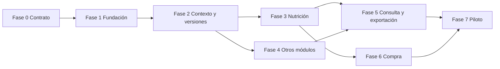

# Roadmap de V1

El roadmap divide V1 en incrementos verticales verificables. Una fase no se considera terminada porque “funcione en local”: debe aportar la evidencia indicada y no dejar abiertas las puertas de salida que le corresponden.

## Fase 0 — Contrato y preparación

### Objetivo

Cerrar la especificación que gobierna el desarrollo.

### Entregables

- Contrato de producto y requisitos.
- Lenguaje ubicuo.
- Arquitectura, dominio, API y gobernanza de datos.
- Contrato numérico, contrato de seguridad y trazabilidad directa.
- Modelo de amenazas y operación.
- Contrato de runbooks operativos que se completarán con comandos reales junto
  a cada capacidad.
- Banco de 92 escenarios y ocho puertas.
- ADR y plan de implementación.

### Salida

- Enlaces válidos y sin contradicciones críticas.
- Cada requisito V1 tiene criterio verificable.
- Ningún documento presenta como implementado un control que solo está diseñado.

## Fase 1 — Fundación segura y vertical mínima

### Objetivo

Desplegar una carcasa privada que permita crear, abrir y aislar un perfil de prueba.

### Alcance

- Monorepo y herramientas de calidad.
- Proyectos Supabase separados para desarrollo y producción.
- PWA base en Cloudflare Pages.
- Invitación, alias, código privado y vinculación de un segundo dispositivo.
- RLS por membresía.
- Sesiones revocables, refresh rotatorio, TTL y limpieza segura de identidades
  anónimas huérfanas.
- Rol de superadministrador, autenticación AAL2 e indicador de impersonación.
- Auditoría técnica privada con `intent/outcome` en ledger externo.
- Copia, streams externos de borrado/auditoría y restauración mínimas
  demostradas.

### Salida

- Dos dispositivos acceden al mismo perfil.
- Un tercer dispositivo no autorizado no puede leerlo.
- Revocar una membresía de perfil no afecta a las demás; cerrar globalmente un
  actor-dispositivo sí revoca todas sus membresías y refresh tokens.
- Restauración probada sin reintroducir un perfil marcado como borrado ni
  truncar acciones administrativas posteriores.

## Fase 2 — Cuestionario, contexto y ciclo de plan

### Objetivo

Recoger contexto completo sin generar todavía recomendaciones clínicas complejas.

### Alcance

- Asistente adaptativo, progreso, tiempo, guardado automático y resumen.
- Selección de módulos y objetivos.
- Condiciones, medicación, suplementos y valores manuales.
- Normalización y validación.
- Borrador, candidato, activo y archivado.
- Eje completo/provisional.
- Clasificación de impacto y diferencias entre versiones.

### Salida

- Perfiles de prueba recorren solo las preguntas aplicables.
- Una ausencia crítica produce incertidumbre explícita.
- Un cambio material crea candidato y no muta el activo.

## Fase 3 — Núcleo nutricional

### Objetivo

Generar una semana alimentaria reproducible y editable.

### Alcance

- Catálogo canónico mínimo con procedencia.
- Motor de energía, macros y fibra.
- Dos a seis comidas.
- Modos simple y equilibrado.
- Alergias, contaminación cruzada, intolerancias, preferencias y ansiedad alimentaria.
- Dos sustitutos por alimento y recalculo completo.
- Lista de compra alimentaria canónica sin SKU.

### Salida

- Los cálculos cumplen `docs/data/NUMERIC_CONTRACT.md`.
- Ningún sustituto viola función, alergia o restricción.
- El mismo manifiesto produce el mismo plan.
- La puerta de cálculos deterministas pasa para el módulo.

## Fase 4 — Módulos de actividad, hidratación, sueño y suplementos

### Objetivo

Completar el plan modular y su reconciliación.

### Alcance

- Entrenamiento generado, propio y ninguno.
- Bloque de cuatro semanas y sesiones detalladas.
- Movilidad de 5/10/15 minutos.
- Hidratación por banda, anclajes y contexto.
- Sueño semanal y diario opcional.
- Suplementos por evidencia, riesgos y seguimiento.
- Reglas clínicas/farmacológicas selectivas prioritarias.
- Reconciliación entre módulos.

### Salida

- Un módulo desactivado no aparece de forma indirecta.
- El nivel de acción más estricto prevalece.
- Cobertura parcial genera salida provisional, no certeza inventada.
- El 100 % de los ejercicios publicables del catálogo V1 tiene ilustración
  secuencial, alternativa accesible, procedencia/licencia y revisión anatómica.

## Fase 5 — Consulta, seguimiento, explicación y exportación

### Objetivo

Convertir el plan validado en una herramienta utilizable cada semana.

### Alcance

- Vistas diaria, semanal y por módulo.
- Edición controlada y candidatos.
- Seguimiento semanal y revisión de cuatro semanas.
- PDF compacto y completo.
- Impresión y exportación compatible con hojas de cálculo.
- Asistente Luna postvalidación, presupuesto y fallback.

### Salida

- Pantalla, PDF, impresión y exportación proceden de la misma versión.
- Una caída de IA no impide consultar ni generar el plan.
- El gasto no supera el límite configurado.
- Los compuestos sensibles no aparecen en exportaciones visuales.

## Fase 6 — Catálogo comercial y compra

### Objetivo

Proyectar la cesta canónica sobre supermercados sin alterar la dieta.

### Alcance

- Ingesta versionada de catálogos.
- Reglas de compatibilidad y revisión administrativa.
- Cesta de prueba 60+20.
- Publicación de cadenas por cobertura.
- Optimización de envases, precio base y sobrante.
- Modo una cadena y comparación multitienda.
- Orden común entre pantalla, PDF e impresión.
- Snapshot semanal congelado compartido por pantalla, impresión, PDF y XLSX.

### Salida

- No existen falsos positivos en la muestra crítica.
- Las cestas parciales se etiquetan correctamente.
- La selección habitual nunca cambia en silencio.
- Una actualización de precio no cambia identidad nutricional.
- Una cesta parcial conserva pendientes y muestra subtotal, nunca un total
  completo inferido.

## Fase 7 — Validación integral y piloto privado

### Objetivo

Demostrar que V1 cumple el contrato antes de invitar usuarios.

### Alcance

- Ejecución de 92 escenarios.
- Pruebas unitarias, de propiedades, integración, E2E, accesibilidad y seguridad.
- Revisión manual de reglas y recursos visuales.
- Restauración de producción ensayada.
- Métricas y alertas operativas.
- SBOM, SCA, hash/firma y procedencia del artefacto de release.
- Corrección de defectos y congelación de versiones iniciales.

### Salida

- Ocho puertas de aceptación aprobadas.
- Cero defectos críticos o altos abiertos.
- Riesgos residuales documentados y aceptados.
- Superadministrador puede operar, revertir y borrar sin acceso directo improvisado a la base.
- Invitaciones habilitadas únicamente después de la revisión final.

## Dependencias principales

## Regla de avance

Se puede desarrollar en paralelo dentro de una fase, pero no se declara completada hasta reunir su evidencia. Un prototipo visual, un test aislado o un dato extraído no sustituyen el criterio de salida.
