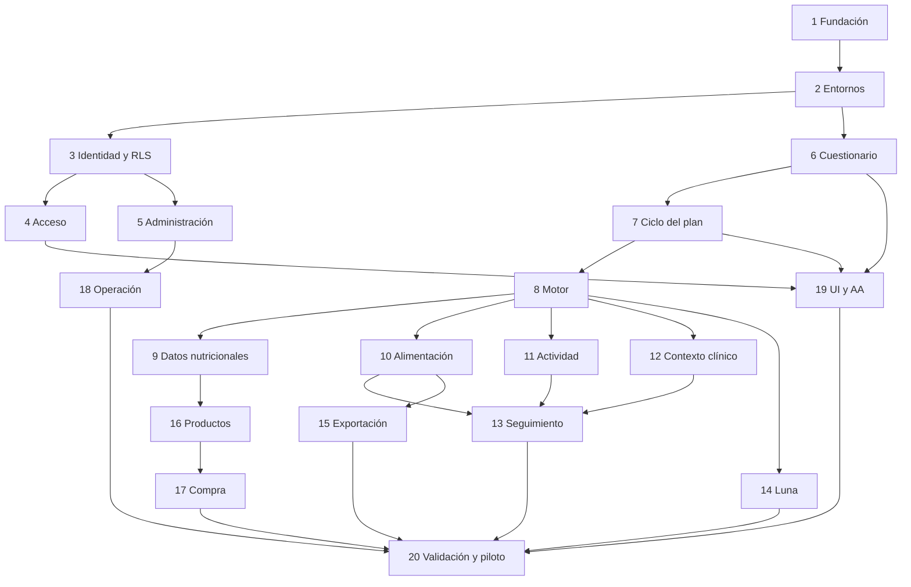

# Plan de implementación de Health Design V1

> **Estado:** plan de ejecución; no demuestra que exista código implementado.  
> **Fecha de referencia:** 2026-07-16  
> **Contrato funcional:** [`PRODUCT.md`](../../PRODUCT.md)  
> **Requisitos verificables:** [`REQUIREMENTS.md`](../../REQUIREMENTS.md)  
> **Puertas de lanzamiento:** [`ACCEPTANCE_GATES.md`](../quality/ACCEPTANCE_GATES.md)

## Objetivo

Construir una PWA privada, por invitación, que permita a adultos crear y
mantener planes versionados de alimentación, entrenamiento opcional,
hidratación, sueño, movilidad y suplementación. Los cálculos, restricciones y
estados deben ser deterministas; Luna solo puede explicar una salida ya
validada. La compra es consultiva y nunca modifica la verdad nutricional.

## Arquitectura de entrega

- **Frontend:** React, TypeScript y Vite como SPA/PWA en Cloudflare Pages.
- **Backend:** Supabase EU con Auth, Postgres, RLS, Edge Functions y Storage
  privado.
- **Dominio:** paquetes TypeScript puros, compartidos por pruebas y funciones
  servidoras, sin dependencia del navegador ni del proveedor LLM.
- **Datos:** revisiones inmutables de reglas, fuentes, catálogos, planes y
  exportaciones.
- **IA:** adaptador Luna detrás de un contrato JSON cerrado, ledger de coste y
  fallback determinista.
- **Calidad:** Vitest, Testing Library, Playwright, axe, pgTAP/Supabase CLI,
  pruebas de propiedades y fixtures sintéticos.

Las versiones concretas se fijarán al iniciar el repositorio con las versiones
estables verificadas ese día y quedarán bloqueadas en el lockfile. No se
copiarán números de versión antiguos de este documento.

## Estructura propuesta del repositorio

```text
.
├── apps/
│   └── web/
│       ├── public/
│       ├── src/
│       │   ├── app/
│       │   ├── components/
│       │   ├── features/
│       │   ├── routes/
│       │   ├── services/
│       │   └── styles/
│       └── tests/
├── packages/
│   ├── contracts/
│   ├── domain/
│   ├── engine/
│   ├── catalog/
│   ├── export/
│   └── test-fixtures/
├── supabase/
│   ├── functions/
│   │   ├── _shared/
│   │   ├── access/
│   │   ├── admin/
│   │   ├── catalogs/
│   │   ├── exports/
│   │   └── plans/
│   ├── migrations/
│   ├── seed.sql
│   └── tests/
│       └── database/
├── tests/
│   ├── e2e/
│   ├── security/
│   └── visual/
├── scripts/
├── wrangler.toml
├── .github/workflows/
├── package.json
├── pnpm-workspace.yaml
└── tsconfig.base.json
```

Los nombres finales de tablas y paquetes podrán afinarse al implementar, pero
no se cambiarán las fronteras descritas en
[`ARCHITECTURE.md`](../architecture/ARCHITECTURE.md) sin ADR.

## Reglas para ejecutar este plan

1. Cada tarea empieza con una prueba fallida o una comprobación objetiva.
2. No se marca una tarea como terminada solo porque exista una pantalla.
3. Ninguna Edge Function usa `service_role` sin validar actor, perfil,
   autorización, AAL y operación.
4. Cada tabla de usuario tiene pruebas RLS positivas y negativas.
5. Las migraciones se prueban desde una base vacía y sobre el snapshot anterior.
6. Todo cambio estructural crea una versión candidata; nunca muta el plan
   activo.
7. Los 92 escenarios son fixtures compartidos, no casos manuales duplicados.
8. Los datos de CI, capturas y exportaciones son siempre sintéticos.
9. Una tarea no amplía V1. Las ideas nuevas van a
   [`FUTURE.md`](../backlog/FUTURE.md).
10. Cada commit sugerido se realiza solo cuando pasan sus verificaciones.

## Comandos de calidad objetivo

El bootstrap debe exponer, como mínimo, estos comandos estables:

```bash
pnpm install --frozen-lockfile
pnpm lint
pnpm typecheck
pnpm test
pnpm test:db
pnpm test:e2e
pnpm test:a11y
pnpm test:supply-chain
pnpm build
pnpm verify
pnpm exec supabase start
pnpm exec supabase db reset
pnpm exec supabase functions serve
```

En la Tarea 1, `pnpm verify` ejecuta generación/validación Edge, formato, lint,
tipos, tests unitarios/contrato, prueba de Chromium y build. La validación de
migraciones se incorporará con `pnpm test:db` en la Tarea 2, cuando existan
migraciones reales. Los E2E completos y restore pueden vivir en jobs separados
por coste y duración, pero son obligatorios antes de abrir invitaciones.

---

## Tarea 1 — Fundación del monorepo y contrato entre runtimes

> **Estado de ejecución (2026-07-17):** implementada y verificada localmente, incluida la prueba de `functions serve`; las attestations permanecen pendientes de su primera ejecución en GitHub. El recibo reproducible está en
> [`docs/quality/TASK_01_VERIFICATION.md`](../quality/TASK_01_VERIFICATION.md).

**Resultado:** un workspace mínimo compila en navegador, Node de pruebas y
Supabase Edge Functions sin duplicar tipos.

**Archivos previstos**

- `package.json`
- `pnpm-workspace.yaml`
- `tsconfig.base.json`
- `eslint.config.js`
- `.prettierrc.json`
- `.gitignore`
- `apps/web/package.json`
- `apps/web/vite.config.ts`
- `apps/web/src/main.tsx`
- `packages/contracts/src/index.ts`
- `packages/domain/src/index.ts`
- `supabase/functions/runtime-smoke/index.ts`
- `.github/workflows/verify.yml`
- `.github/workflows/supply-chain.yml`
- `scripts/verify-supply-chain.mjs`

**Prueba primero**

1. Añadir un tipo y un schema mínimo en `packages/contracts`.
2. Importarlo desde un test Node, desde la app y desde una Edge Function.
3. Confirmar que los tres interpretan el mismo payload.
4. Hacer fallar el build ante un campo adicional no admitido.
5. Hacer fallar el release si lockfile, SCA, SBOM o procedencia del artefacto
   no pueden verificarse.
6. Hacer fallar CI si el repositorio contiene `.env`, claves, certificados,
   dumps, copias o artefactos privados de restore.

**Implementación**

- Inicializar pnpm workspaces sin añadir un orquestador adicional salvo que la
  duración real lo justifique.
- Configurar TypeScript estricto, `noUncheckedIndexedAccess` y módulos
  compatibles con Vite/Deno.
- Añadir Zod o una alternativa equivalente para contratos runtime.
- Resolver desde el principio cómo comparten las Edge Functions el código puro:
  import map o artefacto generado, sin copiar archivos a mano.
- Añadir comprobación de formato, lint, tipos, test y build.
- Fijar lockfile, revisión de dependencias, SCA, SBOM CycloneDX o equivalente,
  hash/firma y procedencia del artefacto de release.
- Ignorar desde el primer commit secretos, `.env*` salvo ejemplo, claves,
  backups, restores, informes privados, `node_modules`, builds y resultados de
  pruebas; ejecutar escaneo de secretos sobre worktree e historial.

**Verificación**

```bash
pnpm verify
pnpm test:supply-chain
pnpm exec supabase functions serve runtime-smoke
EDGE_SMOKE_USE_LOCAL_ANON=true pnpm edge:smoke
```

El subcomando `pnpm exec supabase functions serve` y el último comando constituyen el
smoke HTTP local. La CLI queda fijada en la última versión comprobada que supera
esta puerta; la regresión y su comparación A/B están documentadas en
[`TASK_01_VERIFICATION.md`](../quality/TASK_01_VERIFICATION.md).

**Commit sugerido:** `chore: bootstrap health design monorepo`

## Tarea 2 — Supabase local, entornos y secretos

> **Estado de ejecución (2026-07-17):** completada. Validación local íntegra
> con Vector, reset reproducible, smoke Edge y apagado limpio; separación
> hospedada de Supabase, Pages, Turnstile, Workers y R2 también comprobada. El
> recibo reproducible está en
> [`TASK_02_VERIFICATION.md`](../quality/TASK_02_VERIFICATION.md).

**Resultado:** desarrollo y producción tienen configuraciones aisladas y el
frontend no conoce secretos privilegiados.

**Archivos previstos**

- `supabase/config.toml`
- `supabase/seed.sql`
- `.env.example`
- `wrangler.toml`
- `workers/continuity-ledger/`
- `apps/web/src/services/supabase.ts`
- `scripts/check-public-env.mjs`
- `.github/workflows/verify.yml`
- `docs/runbooks/local-development.md`

**Prueba primero**

- El check debe fallar si el bundle o una variable pública contiene
  `service_role`, pepper, clave de backup o token de Luna.
- El seed debe ser íntegramente sintético y reproducible.
- Un build de preview no puede usar variables de producción.
- La credencial del ledger R2 y las claves de backup no pueden aparecer en
  previews, CI no privilegiado ni bundle.
- CSP/headers de producción permiten únicamente los hosts exactos de Supabase
  y `challenges.cloudflare.com`; Turnstile carga y Siteverify valida.
- Refresh rotation está activada con reuse interval de 10 segundos.

**Implementación**

- Crear proyectos Supabase distintos para `development` y `production`.
- Definir allowlist de variables públicas y privadas.
- Usar Cloudflare Pages para frontend estático.
- Provisionar Worker, Durable Object y dos políticas/buckets R2 separados para
  `deletions` y `admin-audit`; todavía sin ejecutar mutaciones reales.
- Configurar access token exacto de 15 minutos, refresh rotation activa y
  reuse interval de 10 segundos.
- Fijar CSP, HSTS, `no-referrer`, `nosniff`, Permissions Policy, CORS y hosts
  exactos por entorno según el contrato.
- Proteger previews con Cloudflare Access o conectarlos exclusivamente al
  proyecto de desarrollo con datos sintéticos; nunca a producción abierta.
- Documentar arranque, reset, seed, apagado y solución de errores comunes.

**Verificación**

```bash
pnpm exec supabase start
pnpm exec supabase db reset
pnpm build
node scripts/check-public-env.mjs
```

**Commit sugerido:** `chore: configure isolated local and hosted environments`

## Tarea 3 — Esquema de identidad, perfil, membresía y RLS

> **Estado de ejecución (2026-07-17):** completada y verificada localmente con
> 56 pruebas pgTAP propias, reconstrucción desde cero y lint de esquema sin
> warnings. El recibo reproducible está en
> [`TASK_03_VERIFICATION.md`](../quality/TASK_03_VERIFICATION.md).

**Resultado:** una identidad de dispositivo solo puede leer perfiles con una
membresía activa.

**Archivos previstos**

- `supabase/migrations/*_identity_and_profiles.sql`
- `supabase/migrations/*_profile_access_rls.sql`
- `supabase/tests/database/profile_access_test.sql`
- `packages/contracts/src/access.ts`
- `packages/domain/src/access.ts`

**Prueba primero**

- Identidad A con membresía activa puede leer su perfil.
- Identidad B no puede leerlo aunque conozca el UUID.
- Una membresía revocada corta acceso con JWT todavía vigente.
- Revocar una de dos membresías del mismo actor conserva la otra.
- El cliente no puede crear o editar `ProfileAccess`, roles ni auditoría.
- Una identidad anónima sin invitación no ve filas.
- Alias normalizado duplicado entre perfiles `active` o `deletion_requested`
  se rechaza; completar `DeletionJob.status=purged` elimina la fila y lo libera
  sin convertirlo en credencial.
- Dos llamadas concurrentes con el mismo `auth.uid()` producen un solo
  `Actor`; otro `Actor` con ese `auth_subject` se rechaza.
- `private.ensure_actor()` falla para `anon/public`, `auth.uid() IS NULL` y
  actor deshabilitado; nunca acepta sujeto o rol del payload.
- Una segunda membresía activa para el mismo `(profile_id, actor_id)` se
  rechaza, pero una nueva es válida tras revocar la anterior.
- Falta de FK/NOT NULL, timestamp inverso o una segunda `DeviceSession` activa
  para el mismo actor se rechazan.

**Implementación**

- Crear `Actor`, `Profile`, `ProfileAccess`, `Invitation`, `DeviceSession`,
  `PrivateAccessCode` y eventos técnicos mínimos.
- Implementar `private.ensure_actor()` idempotente como `SECURITY DEFINER`:
  deriva el sujeto solo de `auth.uid()`, crea rol `device` por defecto y nunca
  acepta sujeto o rol desde el cliente; revocar `EXECUTE` a `anon/public`,
  fijar `search_path`, exigir UID no nulo y fallar si el actor está
  deshabilitado.
- Imponer `UNIQUE(Actor.auth_subject)` e índice único parcial de membresía
  activa sobre `(profile_id, actor_id) WHERE revoked_at IS NULL`.
- Relacionar todo agregado de usuario con `profile_id`.
- Activar RLS por defecto y grants mínimos.
- Implementar `private.has_active_profile_access(profile_id)` mediante
  `ProfileAccess.actor_id → Actor.id` y después
  `Actor.auth_subject = auth.uid()`, con actor habilitado, membresía activa y
  sesión no expirada y perfil `active`; nunca comparar un campo inexistente.
- Modelar `Profile.status = active|deletion_requested`; `purged` pertenece a
  `DeletionJob` y su transición terminal elimina la fila `Profile`.
- Imponer una sola `DeviceSession` activa por actor-dispositivo y FKs/NOT NULL
  restrictivos, excepto `DeletionJob.profile_id ON DELETE SET NULL`.
- Usar constraints para evitar dos membresías activas duplicadas del mismo
  actor y perfil.

**Verificación**

```bash
pnpm exec supabase db reset
pnpm test:db -- profile_access
```

**Commit sugerido:** `feat: add profile membership model and rls`

## Tarea 4 — Invitación, código privado, QR y sesiones

> **Estado de ejecución (2026-07-17):** completada y verificada localmente con
> 42 pruebas pgTAP propias, 3 flujos E2E, smoke HTTP Edge y verificación común.
> El recibo reproducible está en
> [`TASK_04_VERIFICATION.md`](../quality/TASK_04_VERIFICATION.md).

**Resultado:** alta por invitación y vinculación segura de un segundo
dispositivo, con identidades independientes.

**Archivos previstos**

- `supabase/migrations/*_access_tokens.sql`
- `supabase/functions/access/index.ts`
- `supabase/functions/_shared/rate-limit.ts`
- `supabase/functions/_shared/audit.ts`
- `apps/web/src/features/access/`
- `tests/e2e/access.spec.ts`
- `tests/security/device-link.spec.ts`

**Prueba primero**

- Invitación válida se consume una vez; expirada, revocada o reutilizada falla.
- El secreto de invitación aparece solo en el body del POST; no queda en
  enlace, path, query, fragmento, historial, `Referer` o logs.
- Código y QR tienen entropía, almacenamiento y TTL del contrato.
- Dos consumos concurrentes del QR producen una sola membresía.
- El payload QR no aparece en URL, historial, `Referer`, clipboard, analítica
  ni logs.
- Respuestas de alias inexistente y código incorrecto son equivalentes.
- Tras cinco fallos en 15 minutos se activa el límite; el límite global es
  30/h por IP.
- Rotar código revoca atómicamente el anterior, deja exactamente uno activo y
  no invalida sesiones salvo elección explícita.
- Revocar el acceso de un dispositivo a un perfil no corta sus otros perfiles.
- El consumo devuelve un handle autorizado y `GET /v1/me/profiles` solo lista
  las membresías del actor.
- Turnstile se exige en alta/canje y tras `CHALLENGE_REQUIRED`.
- Replay de refresh fuera de 10 segundos, inactividad de 30 días y máximo de
  180 días revocan la sesión según contrato.
- Revocar una membresía conserva otros perfiles; cerrar/vencer globalmente el
  actor revoca todas sus membresías y todos sus refresh tokens. Un JWT residual
  falla por RLS. Varias pestañas comparten una única `DeviceSession`.
- El job dry-run elimina solo identidades anónimas huérfanas elegibles y nunca
  una identidad con membresía activa o rol.

**Implementación**

- Crear identidad anónima con protección antiabuso.
- Canjear invitación transaccionalmente desde body; un enlace, si existe, solo
  abre la ruta pública sin secreto.
- Mostrar el código privado una sola vez y guardar solo HMAC/KDF.
- Usar índice único parcial para un solo código activo y rotación
  transaccional.
- Generar QR opaco no URL de cinco minutos, un uso y sin datos personales; el
  escáner lo envía solo por `POST`.
- Exponer lista y revocación de sesiones.
- Añadir touch diario idempotente, expiración 30/180 y jobs de limpieza por
  lotes de 100 para Auth anónimo huérfano.
- Implementar TTL propio con `DeviceSession`/RLS como fuente de verdad, sin
  depender de timeboxing nativo de Supabase. El cierre global usa `signOut`
  servidor de todos los refresh tokens del actor; no promete revocación
  individual.
- Diferenciar vinculación, rotación con sesión y restablecimiento
  administrativo.

**Verificación**

```bash
pnpm test --filter access
pnpm test:db -- access
pnpm test:e2e -- access.spec.ts
```

**Commit sugerido:** `feat: implement invitation and device linking`

## Tarea 5 — Superadministrador, AAL2 e impersonación

> **Estado 2026-07-18:** `T5_COMPLETE_REMOTE_PASS`. Implementación fusionada en
> `main`; infraestructura activa en desarrollo y producción; primera cuenta
> superadministradora y TOTP real provisionados solo en desarrollo. AAL1
> rechazado, AAL2 aceptado, inicio/salida de impersonación, `intent/outcome`,
> outbox y cuatro objetos R2 cifrados se comprobaron de extremo a extremo. Véase
> [`TASK_05_VERIFICATION.md`](../quality/TASK_05_VERIFICATION.md).

**Resultado:** las operaciones completas del administrador solo ocurren desde
una cuenta separada, con MFA y actor original conservado.

**Archivos previstos**

- `supabase/migrations/*_admin_and_impersonation.sql`
- `supabase/functions/admin/index.ts`
- `supabase/functions/_shared/audit.ts`
- `workers/continuity-ledger/src/`
- `packages/contracts/src/admin.ts`
- `apps/web/src/features/admin/`
- `tests/security/admin-authorization.spec.ts`
- `tests/security/audit-continuity.spec.ts`
- `tests/e2e/admin-impersonation.spec.ts`

**Prueba primero**

- Un usuario no puede autoasignarse rol o claim.
- AAL1 no puede publicar, borrar, restaurar ni impersonar.
- Toda mutación impersonada conserva actor original, perfil efectivo,
  `request_id` y sesión de impersonación.
- `TechnicalAuditEvent` rechaza `UPDATE`/`DELETE`; dos mutaciones concurrentes
  obtienen secuencia total sin bifurcación.
- Una mutación privilegiada no comienza si el ledger externo no confirma su
  `intent`; `outcome` se finaliza idempotentemente y un intent pendiente queda
  visible.
- Si Postgres revierte antes de crear outbox, `catch/finally` registra
  `outcome=failure`; si tampoco responde, un reconciliador periódico lo cierra
  desde el journal. Restore no es el único reconciliador.
- `AuditOutbox` rechaza payload libre o superior a 4 KiB y los canarios
  sensibles no alcanzan ningún sink.
- Ciphertext/tag/AAD alterados, firma Ed25519 inválida, replay o clave
  desconocida se rechazan.
- El indicador no desaparece al navegar ni refrescar.
- Salir de impersonación devuelve inequívocamente al contexto administrativo.

**Implementación**

- Provisionar la cuenta administrativa fuera del flujo de perfiles.
- Exigir TOTP y `aal2` para operaciones sensibles.
- Implementar funciones privilegiadas con allowlist de acciones.
- Implementar el protocolo `intent → transacción + espejo local + outbox →
  outcome` contra Worker/Durable Object/R2.
- Añadir cierre compensatorio en `catch/finally`, reconciliador periódico de
  intents externos y alarmas desde cinco minutos.
- Crear log técnico privado redactado, cifrado externamente, hash-encadenado,
  append-only y sin grants directos de escritura.
- Cifrar cada objeto con AES-256-GCM/DEK única y envolverla con KEK versionada;
  firmar recibos con Ed25519 y pinning/rotación de claves públicas.
- Aplicar allowlist antes de todo sink; desactivar captura de body, query y
  headers en proxy, Edge, errores y jobs.
- Separar interfaz de usuario e interfaz administrativa.

**Verificación**

```bash
pnpm test:db -- admin
pnpm test:e2e -- admin-impersonation.spec.ts
pnpm test --filter admin
```

**Commit sugerido:** `feat: add aal2 admin operations and impersonation`

## Tarea 6 — Schema del cuestionario y asistente adaptativo

> **Estado 2026-07-18:** `T6_COMPLETE_REMOTE_PASS`. Schema canónico, wizard,
> borrador remoto versionado, ramas, provisionalidad, límites de entrada y
> política de cache pública integrados en `main`. Pasan `pnpm verify`, 10 E2E,
> 157 pgTAP, lint SQL y el smoke remoto completo. Migraciones y Edge `plans`
> están activas solo en desarrollo; producción no se tocó. No se reclama
> generación de planes. Véase
> [`TASK_06_VERIFICATION.md`](../quality/TASK_06_VERIFICATION.md).

**Resultado:** wizard reanudable, con texto libre mínimo, progreso y ramas
condicionadas por módulos y contexto.

**Archivos previstos**

- `packages/contracts/src/questionnaire.ts`
- `packages/domain/src/questionnaire/`
- `apps/web/src/features/questionnaire/`
- `apps/web/src/routes/questionnaire.tsx`
- `supabase/migrations/*_questionnaire_drafts.sql`
- `supabase/functions/plans/questionnaire.ts`
- `tests/e2e/questionnaire.spec.ts`

**Prueba primero**

- Cero módulos se rechaza sin perder borrador.
- Un perfil sin entrenamiento no ve preguntas de rutina generada.
- Una condición o medicación activa solo los campos materiales.
- Cerrar y reabrir conserva el último bloque confirmado.
- Una respuesta crítica ausente queda como incertidumbre y permite provisional.
- El resumen vuelve al selector correcto y conserva el resto.
- Ninguna respuesta aparece en `localStorage`, `IndexedDB`, Cache API, URL,
  historial o cache del service worker.
- Perder conectividad conserva solo el cambio no confirmado en memoria y
  reintenta sin duplicarlo; recargar vuelve al último bloque remoto confirmado.
- Payload justo por encima de bytes, profundidad, array o longitud del contrato
  se rechaza sin parseo parcial.

**Implementación**

- Versionar schema, opciones, dependencias y copy.
- Añadir selectores buscables con entrada libre solo cuando no exista opción.
- Guardar automáticamente con control de versión e idempotencia.
- Mantener cambios no confirmados solo en memoria; no persistir respuestas
  clínicas localmente.
- Configurar el service worker para cachear solo assets públicos inmutables y
  limpiar estado/caches en logout, revocación y borrado.
- Aplicar los límites de entrada de `SECURITY_CONTRACT.md` antes de normalizar.
- Estimar tiempo restante sin prometer exactitud.
- Añadir respuesta inicial y campos dinámicos para laboratorios.
- Implementar módulos y objetivos confirmados.

**Verificación**

```bash
pnpm test --filter questionnaire
pnpm test:e2e -- questionnaire.spec.ts
pnpm test:a11y -- questionnaire
```

**Commit sugerido:** `feat: build adaptive questionnaire wizard`

## Tarea 7 — Snapshots de contexto y ciclo de vida del plan

> **Estado 2026-07-18:** `T7_COMPLETE_REMOTE_PASS`. Snapshots inmutables,
> versiones de plan, candidatos, diff de impacto, activación manual,
> idempotencia y concurrencia validados localmente y en el entorno remoto de
> desarrollo. Pasan `pnpm verify`, 10 E2E, 197 pgTAP, lint SQL, deriva cero y
> el recorrido remoto con snapshot inmutable, replay idempotente, aislamiento
> de actor y cero planes ante `ENGINE_UNAVAILABLE`. El motor numérico continúa
> siendo frontera de T8; producción no se enlazó ni recibió cambios. Véase
> [`TASK_07_VERIFICATION.md`](../quality/TASK_07_VERIFICATION.md).

**Resultado:** contexto normalizado e inmutable; borrador, activo, archivado,
completo y provisional son estados independientes.

**Archivos previstos**

- `supabase/migrations/*_context_and_plan_versions.sql`
- `packages/domain/src/context/`
- `packages/domain/src/plans/`
- `packages/contracts/src/plans.ts`
- `supabase/functions/plans/index.ts`
- `supabase/tests/database/plan_lifecycle_test.sql`

**Prueba primero**

- Un snapshot no cambia después de crearse.
- La primera generación crea un borrador válido; solo una operación manual
  posterior lo convierte en activo.
- Un cambio posterior crea versión candidata y `PlanCandidate`.
- Dos activaciones concurrentes producen un solo activo.
- Un candidato inválido no altera el plan anterior.
- `complete/provisional` no depende de `draft/active/archived`.

**Implementación**

- Crear `ContextSnapshot`, `Plan`, `PlanVersion`, `PlanCandidate`,
  `ChangeEvent` y `SafetyFinding`.
- Usar `expected_version` y transacciones para activación.
- Calcular diff estructurado y dependencias afectadas.
- Guardar hashes y revisiones empleadas.

**Verificación**

```bash
pnpm test:db -- plan_lifecycle
pnpm test --filter plan-lifecycle
```

**Commit sugerido:** `feat: add immutable plan lifecycle`

## Tarea 8 — Núcleo numérico y motor de restricciones

> **Estado 2026-07-18:** `T8_COMPLETE_REMOTE_PASS`. Núcleo puro, determinista
> y versionado implementado y validado en desarrollo. La generación crea
> borradores provisionales y la activación continúa siendo manual. No incluye
> catálogos nutricionales, planes finales de módulos, reglas clínicas
> exhaustivas, Luna, interfaz final ni cambios en producción. Véase
> [`TASK_08_VERIFICATION.md`](../quality/TASK_08_VERIFICATION.md).

**Resultado:** pipeline puro y reproducible que aplica obligatorias,
condicionales y preferentes dentro del espacio seguro.

**Archivos previstos**

- `packages/engine/src/pipeline/`
- `packages/engine/src/numeric/`
- `packages/engine/src/rules/`
- `packages/engine/src/reconciliation/`
- `packages/engine/tests/`
- `packages/test-fixtures/src/engine/`

**Prueba primero**

- Serialización canónica e hashes idénticos para la misma entrada.
- SHA-256 sobre UTF-8/NFC produce el mismo hash entre navegador, Node y Edge;
  campos volátiles no lo alteran y cambiar la versión de canonicalización sí.
- Redondear la UI no modifica el cálculo interno.
- Umbrales, balance de masa y cierre cumplen
  [`NUMERIC_CONTRACT.md`](../data/NUMERIC_CONTRACT.md).
- Una preferencia en conflicto nunca relaja una obligación.
- Gana el nivel de acción más estricto por módulo.
- Dato desconocido permanece desconocido.

**Implementación**

- Usar aritmética decimal explícita; prohibir `number` en cantidades
  normativas salvo conversión controlada.
- Implementar normalización de unidades y estados crudo/cocinado.
- Versionar `Rule`, `RuleRevision`, `RuleSetRevision` y evidencia.
- Separar warnings, incertidumbres, acciones y errores de activación.
- Mantener el motor sin I/O, reloj implícito, red o aleatoriedad.

**Verificación**

```bash
pnpm test --filter engine
pnpm test --filter numeric-contract
```

**Commit sugerido:** `feat: implement deterministic rules engine`

## Tarea 9 — Ingesta nutricional federada y revisiones efectivas

> **Estado 2026-07-19:** `T9_COMPLETE_REMOTE_PASS`. Catálogo federado de
> alimentos genéricos, cuarentena, procedencia, revisiones manuales e historia
> efectiva implementados y validados en desarrollo. No incluye generación de
> dietas, catálogo comercial por GTIN, supermercados, precios ni cambios en
> producción. Véase
> [`TASK_09_VERIFICATION.md`](../quality/TASK_09_VERIFICATION.md).

**Resultado:** alimentos genéricos con procedencia, estado y revisión; ninguna
fuente se promedia silenciosamente.

**Archivos previstos**

- `packages/catalog/src/nutrition/`
- `supabase/migrations/*_nutrition_catalog.sql`
- `supabase/functions/catalogs/nutrition.ts`
- `scripts/import-nutrition/`
- `packages/test-fixtures/src/nutrition/`
- `docs/runbooks/nutrition-import.md`

**Prueba primero**

- CIQUAL 2025 tiene prioridad canónica según el contrato.
- BLS, Fineli, Livsmedelsverket y USDA solo cubren lagunas según orden.
- Un valor desconocido no se convierte en cero.
- Raw/cooked y parte comestible no se mezclan.
- Una discrepancia relevante crea revisión y no publica automáticamente.
- Una etiqueta aprobada por GTIN no modifica el alimento genérico.
- El manifiesto conserva hashes distintos del artefacto bruto y normalizado;
  cambiar un byte o una transformación crea otra revisión.
- Archivo, fila, columna o celda justo por encima del límite se rechaza en
  cuarentena sin publicación parcial.

**Implementación**

- Crear fuente, revisión, alimento, nutriente, observación, alias y revisión
  efectiva.
- Importar a cuarentena, validar schema/unidad/estado/licencia y generar diff.
- Calcular SHA-256 bruto/normalizado y guardar algoritmo y versión canónica en
  `SourceManifest`.
- Aplicar 25 MiB/100.000 filas/200 columnas/2 KiB por celda/100 MiB
  descomprimidos; dividir lotes mayores y prohibir archivos anidados.
- Aplicar los umbrales del contrato numérico.
- Publicar manualmente revisiones efectivas y conservar historia.

**Verificación**

```bash
pnpm test --filter nutrition-catalog
pnpm test:db -- nutrition_catalog
pnpm run import:nutrition -- --fixture
```

**Commit sugerido:** `feat: add federated nutrition catalog`

## Tarea 10 — Generador de alimentación y sustituciones

> **Estado 2026-07-19:** `T10_COMPLETE_REMOTE_PASS`. Cuestionario nutricional,
> semana determinista de 2–6 comidas, dos sustitutos por alimento, recálculo y
> núcleo oficial CIQUAL 2025 implementados y validados en desarrollo. No
> incluye reglas clínicas/farmacológicas de T12, productos GTIN de T16,
> supermercados/precios de T17 ni cambios en producción. Véase
> [`TASK_10_VERIFICATION.md`](../quality/TASK_10_VERIFICATION.md).

**Resultado:** semana estable de 2–6 comidas, con dos sustitutos por alimento y
recálculo completo.

**Archivos previstos**

- `packages/engine/src/modules/nutrition/`
- `packages/domain/src/nutrition/`
- `packages/contracts/src/nutrition.ts`
- `apps/web/src/features/nutrition/`
- `packages/test-fixtures/src/profiles/nutrition/`

**Prueba primero**

- Energía muestra banda y objetivo central.
- Grasa central, carbohidrato residual y fibra cumplen las reglas confirmadas.
- Proteína en polvo no aparece sin elección explícita.
- Alergia y contaminación cruzada excluyen; intolerancia usa cantidad/gravedad;
  gusto solo prioriza.
- Cada sustituto conserva función nutricional y estado compatible.
- Sustituir recalcula alimento, comida, día, semana y lista de compra.
- Modos simple y equilibrado producen semanas distintas pero válidas.

**Implementación**

- Resolver energía, macros, fibra, comidas y distribución temporal.
- Modelar funciones: proteína, carbohidrato base, grasa, fruta/verdura,
  lácteo/equivalente y complemento.
- Incluir ansiedad alimentaria en saciedad, regularidad y estrategias.
- Guardar cantidades de referencia, kcal, macros, fibra y nutrientes clínicos
  aplicables por alimento.
- Generar lista canónica sin SKU.

**Verificación**

```bash
pnpm test --filter nutrition-engine
pnpm test:e2e -- nutrition-plan.spec.ts
```

**Commit sugerido:** `feat: generate nutrition weeks and substitutions`

## Tarea 11 — Entrenamiento, movilidad y activos visuales

> **Estado 2026-07-19:** `T11_COMPLETE_LOCAL_PASS`. Entrenamiento opcional,
> movilidad modular, 20 ilustraciones SVG secuenciales y superficie web
> implementados y verificados localmente en la rama
> `codex/task-11-training-mobility`. No hubo despliegue ni validación remota,
> cambios de base de datos, animaciones o certificación clínica. T12 conserva
> la adaptación clínica/hidratación/sueño/suplementos; T13, seguimiento y
> F47/F48; T15, PDF/impresión; y T19, la puerta AA final. El catálogo CIQUAL
> completo sigue diferido como T10.1 y no bloquea T11. Véase
> [`TASK_11_VERIFICATION.md`](../quality/TASK_11_VERIFICATION.md).

**Resultado:** entrenamiento verdaderamente opcional y sesiones ejecutables con
explicación sencilla e ilustración secuencial.

**Archivos previstos**

- `packages/engine/src/modules/training/`
- `packages/engine/src/modules/mobility/`
- `packages/domain/src/exercises/`
- `apps/web/src/features/training/`
- `apps/web/public/assets/exercises/`
- `scripts/validate-exercise-assets.mjs`
- `docs/runbooks/exercise-assets.md`

**Prueba primero**

- Estado `none` no genera sesiones ni carga oculta.
- Estado `own` adapta el contexto nutricional sin prescribir una rutina; la
  hidratación permanece en T12.
- Estado `generated` incluye todos los campos de sesión requeridos.
- La progresión respeta disponibilidad, equipo, nivel y restricciones.
- El núcleo de movilidad dura cinco minutos y las extensiones son opcionales.
- El catálogo publicable tiene 100 % de activos, alt text, licencia/procedencia
  y revisión visual técnica y anatómica simplificada, sin certificación.

**Implementación**

- Crear catálogo de ejercicios, técnicas, alternativas y limitaciones
  no clínicas.
- Generar bloques de cuatro semanas y sesiones detalladas.
- Diseñar activos propios o reutilizables con licencia compatible; no publicar
  una animación no revisada.
- Ofrecer alternativa textual accesible cuando falle un activo y respetar
  `prefers-reduced-motion`.

**Verificación**

```bash
CI=true pnpm vitest run tests/training-engine.test.ts tests/mobility-engine.test.ts tests/exercise-assets.test.ts
node scripts/validate-exercise-assets.mjs
CI=true pnpm test:a11y
CI=true pnpm exec playwright test tests/e2e/training-plan.spec.ts
```

**Commit sugerido:** `feat: add optional training and mobility modules`

## Tarea 12 — Hidratación, sueño, suplementos y reglas clínicas

> **Estado 2026-07-20:** `T12_COMPLETE_REMOTE_PASS`. Hidratación, sueño,
> suplementación, reglas clínicas/farmacológicas selectivas, búsqueda canónica
> AEMPS/CIMA y experiencia web implementadas y validadas en desarrollo. La
> completitud efectiva falla cerrado y cualquier cambio posterior del catálogo
> clínico requiere activación manual. Producción no cambió. T13 conserva
> seguimiento, vigencia, tendencias y recálculo selectivo; T15, PDF/impresión;
> y T19, la puerta AA final. Véase
> [`TASK_12_VERIFICATION.md`](../quality/TASK_12_VERIFICATION.md).

**Resultado:** módulos reconciliados con contexto clínico/farmacológico
selectivo y provisionalidad explícita.

**Archivos previstos**

- `packages/engine/src/modules/hydration/`
- `packages/engine/src/modules/sleep/`
- `packages/engine/src/modules/supplements/`
- `packages/engine/src/clinical/`
- `supabase/migrations/*_clinical_rule_catalog.sql`
- `apps/web/src/features/hydration/`
- `apps/web/src/features/sleep/`
- `apps/web/src/features/supplements/`

**Prueba primero**

- Agua total y bebida propuesta son conceptos distintos.
- Calor, sudor, ejercicio, restricción de líquidos y farmacología no se suman a
  ciegas.
- Contexto anabólico desplaza al extremo alto seguro sin cantidad fija.
- Sueño diario omitido no bloquea y no produce predicción diagnóstica.
- Suplemento incluye evidencia, confianza, riesgos, interacción, métrica y
  condición de salida.
- Opción experimental aparece separada.
- Una regla parcial o no modelada genera plan provisional, no cobertura falsa.

**Implementación**

- Ingerir identidad farmacológica canónica de AEMPS/CIMA de forma controlada.
- Usar dosis, frecuencia, vía u horario solo si la regla lo exige.
- Implementar niveles `modeled`, `partial` y `unmodeled`.
- Prohibir recomendación o ajuste de sustancias anabólicas recreativas.
- Implementar anclajes flexibles; las notificaciones del sistema operativo se
  mantienen fuera de V1.

**Verificación**

```bash
pnpm test --filter hydration
pnpm test --filter clinical-rules
pnpm test --filter supplements
```

**Commit sugerido:** `feat: add contextual wellness and clinical rules`

## Tarea 13 — Seguimiento, impacto y recálculo selectivo

> **Estado 2026-07-20:** `T13_COMPLETE_REMOTE_PASS`. Revisión semanal y diario
> opcional, historial analítico, tendencias sin predicción, vigencia
> contextual, impacto y candidatos manuales implementados. Migración y Edge
> Function `plans` validadas en desarrollo con dos sesiones reales, aislamiento,
> continuidad entre dispositivos, activación/descarte y limpieza completa.
> Producción no cambió. Evidencia en
> [`TASK_13_VERIFICATION.md`](../quality/TASK_13_VERIFICATION.md).

**Resultado:** revisión semanal mínima, diario opcional y candidatos solo para
los módulos afectados.

**Archivos previstos**

- `supabase/migrations/*_follow_up.sql`
- `packages/engine/src/impact/`
- `apps/web/src/features/follow-up/`
- `supabase/functions/plans/follow-up.ts`
- `tests/e2e/follow-up.spec.ts`

**Prueba primero**

- El formulario semanal solo pregunta variables activas.
- Omitir diario no crea error.
- Laboratorio nuevo conserva historial y usa principalmente el más reciente.
- Confianza decae con vigencia contextual sin bloquear todo.
- Un valor fuera de rango recalcula solo módulos afectados.
- Revisión de cuatro semanas crea candidato y requiere activación manual.

**Implementación**

- Guardar observaciones con fecha, unidad, origen y confianza.
- Calcular tendencia básica sin predicción.
- Mapear cambios a dependencias y generar diff.
- Mantener semana base hasta que el usuario solicite regenerar o active
  candidato.

**Verificación**

```bash
pnpm test --filter follow-up
pnpm test:e2e -- follow-up.spec.ts
```

**Commit sugerido:** `feat: add selective follow-up recalculation`

## Tarea 14 — Adaptador Luna, contrato y presupuesto

> **Estado 2026-07-20:** `T14_COMPLETE_REMOTE_PASS`. Contrato cerrado,
> fallback determinista, adaptador Luna, revisión AAL2, ledger transaccional,
> cuota diaria y corte mensual de 10 EUR implementados. Migración y Edge
> Function `plans` validadas en desarrollo con una llamada real liquidada,
> persistencia única, hash normativo intacto y producción sin cambios.
> Evidencia en
> [`TASK_14_VERIFICATION.md`](../quality/TASK_14_VERIFICATION.md).

**Resultado:** Luna mejora legibilidad sin autoridad sobre el plan y la
aplicación nunca autoriza llamadas por encima del corte mensual.

**Archivos previstos**

- `packages/contracts/src/ai.ts`
- `supabase/functions/plans/explanation.ts`
- `supabase/functions/_shared/ai-budget.ts`
- `supabase/migrations/*_ai_usage.sql`
- `packages/test-fixtures/src/ai/`
- `apps/web/src/features/explanations/`

**Prueba primero**

- No hay llamada si la salida normativa es inválida.
- Campo nuevo, número, dosis, alimento, ejercicio o advertencia no derivada
  invalida toda la respuesta.
- Timeout, JSON inválido, proveedor caído y presupuesto agotado usan fallback.
- Ausencia de `AIProviderRevision` o `PricingFxRevision` aprobada y vigente usa
  fallback sin llamada.
- El timeout de 8 segundos no se reintenta automáticamente.
- El hash normativo es idéntico con y sin Luna.
- Una llamada que podría superar 10 € no se ejecuta.
- Dos llamadas concurrentes que individualmente cabrían pero juntas superarían
  10 € producen como máximo una reserva y una llamada.
- Repetir la misma idempotency key no duplica reserva; timeout/fallo incierto
  conserva la cota como `pending_reconciliation` y liquidar/liberar dos veces
  no duplica coste.
- Precio en moneda del proveedor se convierte a EUR con revisión fechada;
  revisión ausente/caducada activa fallback sin llamada.
- Una estimación media inferior al coste máximo no reduce la reserva: el corte
  usa la cota contractual derivada de máximos de entrada/salida. Un cobro real
  superior a esa cota marca `provider_cost_anomaly` y bloquea llamadas nuevas.
- Si el proveedor admite hard billing cap/prepago, se configura a 10 EUR; un
  incumplimiento externo queda como incidente residual y no como autorización
  válida de la aplicación.
- `cap_eur` distinto de 10,00 se rechaza por constraint en V1.
- Alertas 50/75/90 % y cuota por perfil funcionan.

**Implementación**

- Crear adaptador de proveedor y schema cerrado.
- Reducir payload a información mínima y seudónima.
- Crear `AIProviderRevision` con endpoint, modelo, región, retención, no
  entrenamiento, timeout, retry, `pricing_fx_revision_id` y política de
  minimización.
- Crear `PricingFxRevision` con calendario de precios, moneda→EUR, fuentes,
  manifiesto, fechas efectiva/caducidad, precisión, hash canónico y aprobación.
- Añadir activación manual AAL2 de la revisión; sin revisión activa, el
  adaptador no conoce ningún endpoint utilizable.
- Registrar `provider_revision_id`, `prompt_version`, `prompt_hash`, schema,
  política, tokens y coste; nunca prompt o payload clínico completos.
- Implementar `AIBudgetMonth` con `CHECK cap_eur=10.00` y `AIUsageEvent`:
  bloquear el mes, reservar la cota máxima en EUR atómicamente, llamar solo
  tras confirmarla y liquidar/reconciliar/liberar de forma idempotente.
  Timeout conserva la reserva; anomalía de coste bloquea el adaptador.
- Configurar `gpt-5.6-luna` con el razonamiento más bajo disponible; si el
  proveedor no lo ofrece bajo el contrato aprobado, mantener Luna apagada y no
  sustituir el modelo en silencio.
- Mantener interfaz para un proveedor local futuro sin implementarlo todavía.

**Verificación**

```bash
pnpm test --filter ai-contract
pnpm test --filter ai-budget
```

**Commit sugerido:** `feat: add bounded luna explanation adapter`

## Tarea 15 — PDF, impresión y XLSX privados

**Resultado:** todos los formatos representan exactamente la misma versión y
omiten compuestos sensibles.

> **Estado 2026-07-20:** `T15_COMPLETE_REMOTE_PASS` en rama. La copia precrítica,
> la migración, la Edge Function y el smoke sintético están verificados únicamente
> en desarrollo; producción permanece intacta. El recibo reproducible está en
> [`TASK_15_VERIFICATION.md`](../quality/TASK_15_VERIFICATION.md).

**Archivos previstos**

- `packages/export/src/`
- `supabase/functions/exports/index.ts`
- `supabase/migrations/*_exports.sql`
- `apps/web/src/features/exports/`
- `packages/test-fixtures/src/exports/`
- `tests/e2e/exports.spec.ts`

**Prueba primero**

- PDF compacto y completo comparten `plan_version_id`.
- Ingredientes/cantidades y preparación breve no alteran nutrientes.
- XLSX contiene hojas Plan, Compra, Preparación y Metadatos cuando aplican.
- Celdas que empiezan por caracteres de fórmula se neutralizan.
- Ningún formato incluye compuestos sensibles.
- Descarga sin JWT, sesión vigente o membresía falla.
- El endpoint proxy no redirige a URL firmada ni expone bearer de Storage en
  path/query/fragment/logs; la respuesta usa `no-store, private` y
  `no-referrer`.
- Más de 20 exportaciones por hora/perfil, concurrencia duplicada o config de
  más de 16 KiB se limita según contrato; la misma idempotency key reutiliza
  el artefacto.
- Mismo orden en pantalla, PDF e impresión.

**Implementación**

- Usar `pdf-lib@1.17.1` y SheetJS CE `0.20.3` fijado desde el CDN oficial, según
  [`ADR-0008`](../adr/0008-edge-pdf-and-xlsx-renderers.md); ambos funcionan en el
  runtime Deno de Edge sin un runtime alternativo.
- Generar artefacto idempotente por versión/configuración.
- Guardar en bucket privado y transmitir por Edge Function autenticada con
  credencial servidora de mínimo alcance; no emitir URL firmada al navegador.
- Añadir estilos A4, saltos de página y alternativa accesible HTML.

**Verificación**

```bash
pnpm test --filter export
pnpm test:e2e -- exports.spec.ts
pnpm test:a11y -- print
```

**Commit sugerido:** `feat: export versioned plans to pdf and xlsx`

## Tarea 16 — Productos comerciales, código de barras y publicación

**Estado:** `T16_COMPLETE_REMOTE_PASS`; implementación y validación local
completas, copia T16 verificada, cinco migraciones, cinco Edge Functions y Worker
de continuidad activos en desarrollo. El smoke con dos perfiles, AAL2 real,
revisión y activación manual, PDF/XLSX privados, auditoría `intent/outcome` y
limpieza sin residuos privados han superado la validación remota. Producción no
se ha modificado.

**Resultado:** los datos de producto se confirman, corrigen, revisan y comparten
sin contaminar el canon genérico.

**Archivos previstos**

- `packages/catalog/src/products/`
- `supabase/migrations/20260721084023_commercial_products.sql`
- `supabase/migrations/20260721114021_commercial_product_plan_application.sql`
- `supabase/migrations/20260721143000_commercial_product_admin_audit.sql`
- `supabase/migrations/20260721154500_commercial_product_concurrency_sync.sql`
- `supabase/migrations/20260721160000_commercial_product_application_lint.sql`
- `supabase/functions/catalogs/products.ts`, `plans/lifecycle.ts` y `admin/index.ts`
- `apps/web/src/features/barcode/`
- `apps/web/src/features/admin/ProductReviewPanel.tsx`
- `scripts/commercial-products-remote-smoke.mjs`
- `docs/runbooks/commercial-product-publication.md`

**Prueba primero**

- Escanear siempre exige confirmación.
- La corrección confirmada se reutiliza inmediatamente solo en el perfil
  propietario.
- Otro perfil no puede leer una propuesta privada; tras aprobar, recibe una
  nueva revisión global que referencia la propuesta sin mutarla.
- Tras publicar, otro perfil que escanea el mismo GTIN recibe la revisión.
- Un producto tiene como máximo un canónico activo.
- `unknown` alergénico nunca se autoelige.
- Importar no publica; ocultar no borra historia.
- Todo `CommercialProductRevision` y `CatalogRevision` importado enlaza
  `SourceManifest`, evidencia de captura y hashes bruto/normalizado; reimportar
  contenido alterado crea revisión distinta.
- Corrección SKU supera 64 KiB, 200 grafemas de nombre o 100 campos y se
  rechaza antes de crear revisión.

**Implementación**

- Usar `BarcodeDetector` cuando exista y fallback compatible en el resto.
- Separar `CommercialProductRevision`, etiqueta, corrección propuesta,
  corrección publicada y match canónico.
- Modelar `BarcodeCorrection` con `scope`, `owner_profile_id`, estados y RLS;
  precedencia perfil → global → etiqueta → importación.
- Aplicar exclusiones antes de scoring.
- Estados: `exact`, `allowed`, `review`, `excluded`, `insufficient`.
- Aplicar límites de SKU e importación antes de parsear; lotes grandes se
  fragmentan.
- Auditar la activación manual.
- Mantener la adquisición de Open Food Facts bajo demanda: T16 no importa un
  catálogo masivo ni introduce SKU/cadena/precio, que siguen en T17.

**Verificación**

```bash
pnpm exec vitest run tests/commercial-products.test.ts tests/products-edge.test.ts tests/commercial-product-application.test.ts tests/admin-product-review.test.ts
pnpm test:db
pnpm exec playwright test tests/e2e/nutrition-plan.spec.ts --grep "confirma un código"
CI=true pnpm verify
pnpm test:t16:remote # solo después de autorización explícita y copia precrítica
```

**Commit sugerido:** `feat: add reviewed commercial product catalog`

## Tarea 17 — Catálogos de supermercado y optimizador de compra

> **Estado 2026-07-23:** T17A–D fusionados; T17E.1–E.3 en
> `T17_COMPLETE_REMOTE_PASS` exclusivamente en Development.
> Mercadona está publicada en Development; DIA y ALDI continúan sin publicar.
> Production no fue modificada.

**Resultado:** cesta orientativa por cadena o multitienda sin checkout y sin
alterar kcal/macros.

**Archivos previstos**

- `packages/catalog/src/supermarkets/`
- `packages/engine/src/shopping/`
- `supabase/migrations/*_supermarket_catalogs.sql`
- `supabase/functions/catalogs/shopping.ts`
- `apps/web/src/features/shopping/`
- `packages/test-fixtures/src/shopping/`

**Prueba primero**

- El precio por envase se deriva del precio base y contenido confirmado.
- Se agregan cantidades semanales y solo se descuenta sobrante confirmado.
- Una línea sin producto muestra `Sin producto confirmado`.
- No se llama “más barato” a una cesta incompleta.
- La cadena habitual se conserva aunque exista una alternativa.
- La comparación multitienda acepta ahorro de céntimos sin umbral mínimo.
- Orden inicial: precio normalizado ascendente; asc/desc y A–Z/Z–A coinciden
  en todos los formatos.
- Cambiar SKU no modifica el plan nutricional.
- Una segunda resolución concurrente devuelve el handle existente; superar
  30/h por perfil o 100/h por IP devuelve `429` con `Retry-After`.

**Implementación**

- Convertir los scrapers existentes en importadores de cuarentena versionados.
- Mantener origen Sevilla solo como metadato interno.
- Modelar formato, cantidad y precio base sin presentar presencia en catálogo
  como stock ni mostrar fecha de catálogo en V1.
- Implementar cesta 60+20 y puerta de publicación de cadena.
- Añadir modo una cadena, avisos de ahorro y comparación multitienda opcional.
- Exigir idempotency key y los límites por perfil/actor/IP del contrato.

**Verificación**

```bash
pnpm test --filter shopping
pnpm test --filter catalog-coverage
pnpm test:e2e -- shopping.spec.ts
```

**Commit sugerido:** `feat: add consultative supermarket shopping`

## Tarea 18 — Borrado, backups, restore y observabilidad

> **Estado 2026-07-24:** `T18_COMPLETE_LOCAL_PASS`. Validación local,
> remediación de 17 hallazgos de Codex Security y revisión independiente
> cerradas sin residuales materiales. Development requiere autorizaciones
> destructivas separadas; Production no se ha tocado.

**Resultado:** continuidad verificable con cuatro rotaciones y ningún perfil
borrado reaparece.

**Archivos previstos**

- `supabase/migrations/*_deletion_and_operations.sql`
- `supabase/functions/admin/deletion.ts`
- `supabase/functions/admin/backups.ts`
- `scripts/backup/`
- `scripts/restore/`
- `scripts/verify-tombstones.mjs`
- `scripts/verify-continuity-ledger.mjs`
- `scripts/verify-audit-ledger.mjs`
- `scripts/cleanup-anonymous-auth.mjs`
- `docs/runbooks/backup-restore.md`
- `docs/runbooks/permanent-deletion.md`
- `docs/runbooks/anonymous-auth-cleanup.md`
- `docs/runbooks/audit-retention-deletion.md`
- `tests/security/restore-deletion.spec.ts`
- `tests/security/audit-continuity.spec.ts`

**Prueba primero**

- Backup cifrado tiene manifiesto y hashes verificables.
- El conjunto incluye dump Postgres y objetos privados de Storage; restaurar
  solo metadatos se considera fallo.
- Se mantienen cuatro rotaciones y copia precrítica.
- Restore ocurre aislado y falla cerrado ante discrepancia.
- Los streams externos `deletions` y `admin-audit` y su copia local verifican
  secuencia/hash antes de importar o servir datos.
- Perfil borrado no reaparece al restaurar ninguna de las cuatro copias.
- `DeletionJob` terminal conserva handle/marcador y `profile_id=NULL` después
  de eliminar `Profile`; consultar estado no depende de una fila borrada.
- Acciones administrativas posteriores a una copia reaparecen en el espejo de
  auditoría tras restore; un `intent` sin `outcome` bloquea promoción hasta
  reconciliarse.
- Un rango `admin-audit` borrado conserva intent/complete y manifiesto firmado
  en `deletions`; restore elimina cualquier payload reaparecido, acepta solo el
  hueco exacto y bloquea si el job quedó parcial.
- Ciphertext, tag o AAD alterados y recibos Ed25519 inválidos/repetidos se
  rechazan; una rotación conserva verificables los recibos antiguos.
- La purga incluye memberships, datos, Storage, exportaciones, cachés y
  artefactos de IA; Auth solo cuando la identidad queda huérfana.
- Canarios en body/query/headers/código/QR/Turnstile/medicación no aparecen en
  ningún sink de logs.
- Un job parcial permanece `deletion_requested` y se reanuda; nunca vuelve a
  `active`.
- La KEK versionada rota y puede recuperar copias antiguas hasta su expiración.
- La clave HMAC de tombstones es separada; una rotación reemite y verifica todos
  los marcadores antes de retirar la versión anterior.
- El job de Auth anónimo hace dry-run y solo elimina huérfanos elegibles; nunca
  un actor con membresía activa o rol.

**Implementación**

- Crear `DeletionJob`, `BackupJob`, `RestoreJob`, `AuditDeletionJob` y
  `AuditRangeTombstone` idempotentes y reanudables. `DeletionJob.profile_id`
  usa `ON DELETE SET NULL` después de guardar marcador/handle mínimos.
- Completar el coordinador Worker/Durable Object: escribir tombstones con
  Bucket Lock y auditoría cifrada `intent/outcome`; generar copia local cifrada
  semanal de ambos streams.
- Implementar AES-256-GCM por objeto, DEK única envuelta con KEK versionada,
  AAD cerrado, recibos Ed25519 y rotación/pinning de claves públicas.
- Reconstruir/completar `TechnicalAuditEvent` desde el stream externo y
  bloquear restore ante secuencias ausentes o intents pendientes.
- Implementar reconciliador operativo de intents sin outbox y protocolo de
  borrado de rango: manifiesto ordenado, recibo intent en `deletions`,
  credencial offline R2 JIT/prefijo mínimo, verificación de ausencia, recibo
  complete, revocación de credencial y resume ante fallo parcial.
- Usar clave de datos aleatoria por backup y KEK versionada en gestor de
  secretos/contraseñas con recuperación offline.
- Implementar RPO ≤7 días y runbook RTO ≤24 h.
- Añadir métricas, alertas y `request_id` sin payloads de salud.
- Implementar cleanup diario de sesiones/identidades anónimas y el runbook
  destructivo separado para retención de auditoría.
- Ensayar restore después de cambios de esquema.

**Verificación**

```bash
pnpm test --filter operations
pnpm test:security -- restore-deletion.spec.ts
pnpm run restore:drill -- --fixture
```

**Commit sugerido:** `feat: add backup restore and permanent deletion`

## Tarea 19 — Sistema de diseño, AA, responsive y estados

**Resultado:** interfaz rigurosa, serena y accesible en móvil, escritorio,
impresión y estados provisionales.

**Archivos previstos**

- `apps/web/src/styles/tokens.css`
- `apps/web/src/components/ui/`
- `apps/web/src/components/states/`
- `apps/web/src/app/router.tsx`
- `apps/web/tests/accessibility/`
- `tests/visual/`

**Prueba primero**

- Navegación completa por teclado sin trampas.
- VoiceOver/Safari y NVDA/Chrome anuncian progreso, error y cambios.
- Conocido/estimado/incierto no dependen del color.
- Contrastes y objetivos táctiles cumplen
  [`DESIGN_BRIEF.md`](../ui/DESIGN_BRIEF.md).
- 320–1440 px, zoom 200 %, reduced motion y A4 no pierden datos.
- La impersonación tiene banner persistente.

**Implementación**

- Crear tokens semánticos antes de pantallas específicas.
- Construir selectores, combobox, stepper, tablas responsivas, diff, alertas,
  skeletons y estados vacíos.
- Mantener copy sencillo para RPE/RIR, provisionalidad y hallazgos.
- Evitar dashboards clínicos alarmistas y antirreferencias confirmadas.

**Verificación**

```bash
pnpm test:a11y
pnpm test:e2e -- core-user-flows.spec.ts
pnpm run test:visual
```

**Commit sugerido:** `feat: implement accessible product interface`

## Tarea 20 — Banco de 92 escenarios, CI y piloto privado

**Resultado:** G1–G8 tienen evidencia reproducible y el sistema está preparado
para un máximo inicial de diez usuarios invitados.

**Archivos previstos**

- `packages/test-fixtures/src/scenarios/`
- `tests/e2e/scenarios/`
- `tests/security/`
- `scripts/verify-traceability.mjs`
- `scripts/release-gates.mjs`
- `.github/workflows/verify.yml`
- `.github/workflows/e2e.yml`
- `.github/workflows/security.yml`
- `.github/workflows/restore-drill.yml`
- `docs/evidence/README.md`
- `docs/runbooks/private-pilot.md`

**Prueba primero**

- C01–C22 y F01–F70 existen exactamente una vez.
- Todo requisito V1 tiene al menos un escenario y una puerta.
- Cada escenario registra invariantes, acción e incertidumbre aplicables.
- F06 cubre rotación que invalida el código anterior; F07 restore conserva
  borrados y auditoría; F10 cubre actor/ledger concurrente; F69/F70 cubren
  límites, caches, redacción, sesiones y reserva Luna.
- Un hallazgo crítico/alto bloquea el release.
- `PASS WITH DEFERRED` solo acepta trabajo fuera de V1 con dueño y fecha.
- El artefacto desplegable conserva SBOM, SCA sin bloqueadores,
  hash/firma y procedencia verificable.

**Implementación**

- Convertir el catálogo documental en fixtures ejecutables comunes.
- Ejecutar cada caso en la capa mínima suficiente y E2E donde sea necesario.
- Archivar versión de reglas, catálogos, seed, entorno y artefactos sintéticos.
- Archivar SBOM, resultados SCA, firma/hash y procedencia del build.
- Ejecutar canarios de logs/caches, carreras de Actor/auditoría/presupuesto,
  replay de refresh, cleanup anónimo y límites exactos de payload/rate.
- Configurar previews protegidos y despliegue manual de producción.
- Ensayar invitación, soporte, rollback, corte de Luna y borrado.
- Abrir invitaciones únicamente tras PASS explícito de G1–G8.

**Verificación**

```bash
pnpm verify
pnpm test:e2e
pnpm test:a11y
pnpm test:security
pnpm test:supply-chain
pnpm run verify:traceability
pnpm run release:gates
```

**Commit sugerido:** `test: enforce v1 scenarios and release gates`

---

## Orden de ejecución y paralelismo seguro



Después de T8 pueden desarrollarse en paralelo datos, módulos y adaptador de
IA, siempre que no editen simultáneamente los mismos contratos compartidos.
T20 no empieza como cierre hasta que las tareas anteriores entreguen sus
fixtures y evidencias.

## Hitos de revisión

| Hito | Incluye | Decisión |
|---|---|---|
| H0 | T1–T2 | ¿Comparten contrato web, tests y Edge sin duplicación? |
| H1 | T3–T5 | ¿Identidad, RLS y superadmin son seguros y operables? |
| H2 | T6–T8 | ¿Existe un corte vertical cuestionario→plan determinista? |
| H3 | T9–T13 | ¿Los módulos producen una semana coherente y versionada? |
| H4 | T14–T15 | ¿IA y exportación son reemplazables y privadas? |
| H5 | T16–T18 | ¿Catálogos, compra y continuidad respetan el canon? |
| H6 | T19–T20 | ¿G1–G8 pasan y puede comenzar el piloto? |

En cada hito se revisan también deuda, dependencias, costes, migraciones y
desviaciones respecto al contrato. Una desviación aceptada necesita ADR o
cambio explícito de producto.

## Matriz de ejecución de las puertas

| Gate | Tareas propietarias | Requisitos principales | Evidencia que entrega T20 |
|---|---|---|---|
| G1 | T6, T7 | REQ-INT-001–007, REQ-MOV-001, REQ-SLP-001, REQ-QA-001 | wizard/autosave/resumen y escenarios C/F aplicables |
| G2 | T8–T10, T14 | REQ-PLN-001–002, REQ-NUT-001–006, REQ-DAT-004, REQ-AI-001–003, REQ-QA-001 | propiedades, hashes, contrato decimal y rechazo de salida IA |
| G3 | T8, T10, T12–T13, T16 | REQ-PLN-002, REQ-NUT-007–008, REQ-CLN-001–003, REQ-SUP-001–002, REQ-LAB-001, REQ-LAB-002, REQ-QA-001 | conflictos, niveles de acción, provisionalidad, laboratorios y alergias |
| G4 | T10–T13, T17 | REQ-PLN-004, REQ-MOV-001, REQ-MOV-002, REQ-MOV-003, REQ-HYD-001, REQ-HYD-002, REQ-SLP-001, REQ-SLP-002, REQ-FOL-001, REQ-SHP-001, REQ-SHP-002, REQ-QA-001 | perfiles integrados, impacto y ausencia de módulos ocultos |
| G5 | T7, T13, T14, T18 | REQ-PLN-003, REQ-PLN-004, REQ-PLN-005, REQ-PLN-006, REQ-PLN-007, REQ-FOL-002, REQ-LAB-001, REQ-LAB-002, REQ-AI-003, REQ-AI-005, REQ-QA-001 | concurrencia, diff, activación y reproducción histórica |
| G6 | T9–T10, T15–T17 | REQ-DAT-001–007, REQ-SHP-001–005, REQ-EXP-001–004, REQ-QA-001 | procedencia, límites de publicación y exportaciones equivalentes |
| G7 | T1–T5, T14, T18, T20 | REQ-ACC-001, REQ-ACC-002, REQ-ACC-003, REQ-ACC-004, REQ-ACC-005, REQ-ACC-006, REQ-ACC-007, REQ-ACC-008, REQ-ADM-001, REQ-ADM-002, REQ-ADM-003, REQ-OPS-001, REQ-OPS-002, REQ-OPS-003, REQ-OPS-004, REQ-OPS-005, REQ-QA-001, REQ-QA-003, REQ-AI-004, REQ-AI-005 | RLS, AAL2, rate limits, SBOM, restore, ledger y presupuesto |
| G8 | T6, T11–T12, T15, T19 | REQ-INT-002, REQ-INT-005, REQ-MOV-002, REQ-MOV-003, REQ-MOV-004, REQ-HYD-003, REQ-EXP-001, REQ-EXP-002, REQ-EXP-003, REQ-EXP-004, REQ-QA-001, REQ-QA-002 | teclado/lector, responsive, anclajes, impresión y activos accesibles |

T20 agrega y archiva evidencia; no sustituye las pruebas que debe producir cada
tarea propietaria.

## Definición de terminado por tarea

Una tarea solo está terminada cuando:

- el código y las migraciones están versionados;
- pruebas normales, de borde, fallo, autorización y concurrencia aplicables
  pasan;
- no hay secretos ni datos reales en repositorio o CI;
- los requisitos y escenarios relacionados siguen trazados;
- los documentos afectados están actualizados;
- existe un procedimiento de rollback cuando modifica datos o infraestructura;
- no queda un hallazgo crítico/alto abierto en su superficie;
- el cambio se ha probado en `development`, no directamente en producción.

## Decisiones que requieren una pausa explícita

La implementación debe detenerse y volver al contrato si aparece cualquiera de
estas situaciones:

- el runtime de Edge Functions no soporta de forma fiable el motor o la
  generación de exportaciones;
- una fuente o activo no permite el uso previsto por licencia;
- una regla clínica requiere precisión o cobertura no modelada;
- Supabase, Cloudflare o Luna cambian una capacidad de seguridad relevante;
- el presupuesto de 10 € resulta incompatible con el volumen real;
- el piloto necesita más de diez usuarios o funciones fuera de V1;
- un flujo exige compartir refresh tokens o exponer `service_role`;
- una restauración no puede garantizar que los borrados permanezcan borrados.

La pausa no implica abandonar la función: obliga a documentar alternativas,
elegir una y registrar la decisión antes de seguir.
