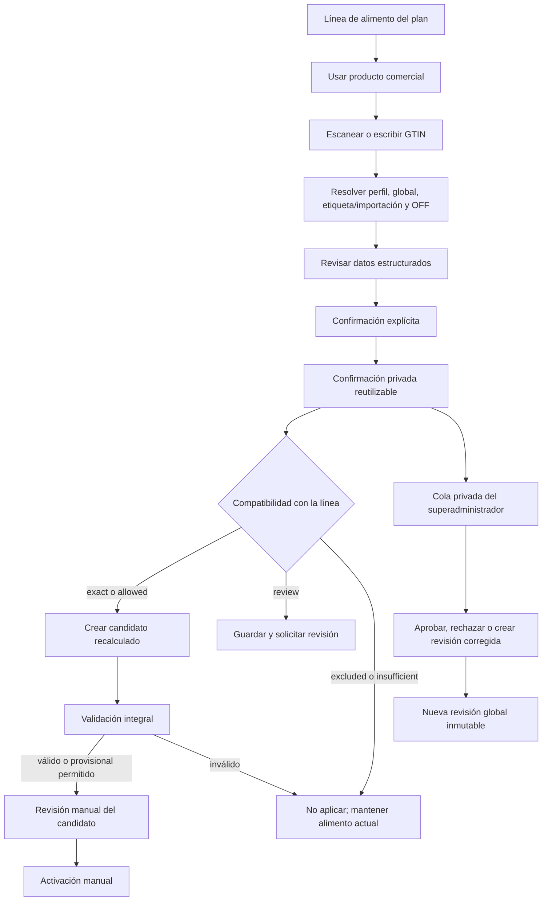

# Contrato T16 — Productos comerciales, códigos de barras y aplicación al plan

**Estado:** `T16_PLANNED`
**Fecha:** 2026-07-21
**Aprobación:** contrato confirmado por el usuario el 2026-07-21.
**Naturaleza de este documento:** planificación; no acredita implementación, migración,
despliegue ni validación remota.
**Dependencias ya disponibles:** identidad y acceso, RLS y borrado, planes versionados,
catálogo nutricional genérico, seguimiento, exportaciones PDF/XLSX y administración AAL2.
**Requisitos cubiertos:** `REQ-DAT-001`, `REQ-DAT-003`, `REQ-DAT-005`,
`REQ-DAT-007` y la frontera nutricional de `REQ-SHP-001`. `REQ-DAT-006` permanece en
T17 porque regula la cobertura y publicación de cadenas de supermercado.

## 1. Resultado comprometido

T16 permitirá que un adulto:

1. abra desde un alimento concreto del plan la acción **Usar producto comercial**;
2. escanee o escriba un código GTIN;
3. recupere datos estructurados previamente confirmados o, si no existen, consulte
   Open Food Facts bajo demanda;
4. revise, complete o corrija los datos sin subir fotografías;
5. confirme expresamente la ficha;
6. la reutilice de inmediato dentro de su propio perfil;
7. la aplique a esa línea de alimento mediante un candidato recalculado y validado;
8. active ese candidato solo mediante una acción manual posterior.

Las correcciones privadas podrán llegar a una cola del superadministrador. Su aprobación
creará una revisión global nueva e inmutable para beneficiar a otros perfiles que escaneen
el mismo GTIN. La propuesta privada original no se mutará ni se expondrá.

El resultado técnico de T16 será:

- identidad GTIN validada y normalizada;
- revisiones comerciales estructuradas e inmutables;
- confirmaciones obligatorias por perfil;
- correcciones privadas con publicación global moderada;
- matching canónico con exclusiones primero;
- aplicación nutricional mediante el ciclo de candidatos existente;
- trazabilidad, idempotencia, límites y eliminación coherentes con el resto de V1.

## 2. Alcance y fronteras

### 2.1 Incluido en T16

- Lectura de `EAN-8`, `EAN-13`, `UPC-A`, `UPC-E` e `ITF-14`.
- Entrada manual permanente como alternativa a la cámara.
- Resolución bajo demanda por precedencia de fuentes.
- Ficha estructurada editable y confirmación obligatoria.
- Nombre, marca, formato y contenido neto cuando se conozcan.
- Ingredientes, alérgenos y posible contacto cruzado.
- Energía, grasas, saturadas, hidratos, azúcares, proteínas y sal.
- Fibra y nutrientes clínicamente relevantes cuando estén declarados o sean necesarios.
- Estados explícitos de dato conocido, desconocido y estimado.
- Corrección privada, cola administrativa y revisión global aprobada.
- Compatibilidad con un alimento canónico y aplicación a una línea concreta del plan.
- Recálculo de cantidad, comida, día, semana, lista de compra y módulos afectados.
- Candidato revisable, validación integral y activación siempre manual.
- Proyección coherente en pantalla, PDF, XLSX e impresión después de activar una versión.
- Purga de datos privados al eliminar permanentemente un perfil.

### 2.2 Excluido y asignado expresamente a T17

- Catálogos completos por supermercado.
- Cadena, tienda, ubicación, precio, oferta, disponibilidad o historial de precio.
- `CatalogRevision` y `CatalogPublication` de supermercados.
- Matching para elegir el envase más barato.
- Cestas monoestablecimiento o multiestablecimiento.
- Automatización de scrapeos y publicación de cadenas.

Un SKU sugerido únicamente para comprar seguirá sin alterar kcal, macros o fibra. T16
solo cambia la nutrición cuando el usuario confirma una **ficha de producto** y la aplica
expresamente como alimento del plan.

### 2.3 Diferido a una versión posterior

- Fotografías de etiquetas o envases.
- OCR o extracción automática mediante IA.
- Inferencia visual de ingredientes, alérgenos o valores nutricionales.
- Confirmación automática sin revisión humana.
- Importación masiva del catálogo de Open Food Facts.
- Sincronización de correcciones hacia proveedores externos.

## 3. Lenguaje canónico

| Término | Significado contractual |
|---|---|
| `CanonicalFood` | Alimento genérico del catálogo nutricional, por ejemplo, pechuga de pollo. T16 nunca modifica su revisión. |
| `CommercialProduct` | Identidad estable de un producto comercial, agrupada por GTIN canónico. |
| `CommercialProductRevision` | Snapshot estructurado, inmutable y con procedencia de la ficha de ese producto. |
| `ProductConfirmation` | Acción explícita de un perfil que acepta una revisión sin cambios o una corrección propia. |
| `BarcodeCorrection` | Propuesta privada o global que contiene un snapshot completo; nunca un parche parcial. |
| `GlobalProductRevision` | Nueva revisión compartida creada tras aprobación del superadministrador. |
| `ProductMatchingRule` | Revisión que relaciona un GTIN con un alimento canónico y registra compatibilidad y exclusiones. |
| `ProductApplication` | Petición de usar una confirmación concreta en una línea concreta de una versión del plan. |
| `PlanCandidate` | Nueva versión recalculada, todavía inactiva, resultante de la aplicación. |
| `Shopping SKU` | Envase comercial usado para compra. Precio, formato o disponibilidad no son autoridad nutricional. |

## 4. Invariantes obligatorias

1. **T16-I01 — Sin confirmación no hay persistencia privada ni aplicación.** Escanear o
   consultar solo abre una revisión.
2. **T16-I02 — Sin mutación silenciosa.** Confirmar, corregir, aprobar o aplicar nunca
   modifica el plan activo en el mismo paso.
3. **T16-I03 — El canónico no se contamina.** Una etiqueta comercial no edita
   `CanonicalFood` ni `FoodCompositionRevision`.
4. **T16-I04 — Compra y nutrición están separadas.** Cambiar precio, cadena,
   disponibilidad o envase no recalcula el plan.
5. **T16-I05 — Desconocido no significa cero.** Un valor ausente conserva estado
   `unknown`; cualquier cifra de cálculo estimada mantiene su origen y confianza.
6. **T16-I06 — Snapshot completo.** Las correcciones y aprobaciones contienen la ficha
   completa normalizada; no se aprueban campos sueltos.
7. **T16-I07 — Inmutabilidad.** Una edición crea revisión nueva con `supersedes_id`;
   nunca sobrescribe la anterior.
8. **T16-I08 — Aislamiento.** Una propuesta privada solo puede resolverse para su perfil
   y para el superadministrador.
9. **T16-I09 — Publicación no destructiva.** Aprobar crea una revisión global nueva y
   no cambia la propuesta privada.
10. **T16-I10 — Exclusiones primero.** Alergia, contacto cruzado, intolerancia,
    ingredientes, estado y restricciones clínicas se evalúan antes de compatibilidad.
11. **T16-I11 — Un vínculo global activo.** Cada GTIN tiene como máximo un alimento
    canónico global activo.
12. **T16-I12 — Incertidumbre conservada.** Un dato clínicamente necesario ausente
    impide aplicar el producto; un dato no crítico ausente produce candidato provisional.
13. **T16-I13 — Dos sustituciones.** El alimento comercial aplicado mantiene exactamente
    dos alternativas válidas y recalculadas.
14. **T16-I14 — Activación manual.** Solo un candidato válido y confirmado por el usuario
    puede sustituir la versión activa.
15. **T16-I15 — Reproducción histórica.** Cada versión del plan referencia exactamente la
    revisión comercial usada, aunque después sea sustituida, rechazada u ocultada.
16. **T16-I16 — Cámara efímera.** Los fotogramas se procesan localmente y nunca se
    transmiten ni almacenan.
17. **T16-I17 — Borrado coherente.** La eliminación permanente purga correcciones y
    confirmaciones privadas; las revisiones globales pierden todo vínculo identificable.
18. **T16-I18 — IA no autoritativa.** T16 no usa Luna ni otro LLM para extraer, completar,
    validar o decidir datos de etiqueta.

## 5. Flujo extremo a extremo



### 5.1 Apertura contextual

- La acción aparece dentro de cada alimento del plan nutricional.
- La línea aporta `planId`, `baseVersionId`, posición, `canonicalFoodKey`, función,
  cantidad y revisión esperada.
- No se crea en T16 una página general de “Mis productos”.
- Una confirmación ya guardada para el mismo GTIN se propone de inmediato al mismo
  perfil, pero la aplicación sigue requiriendo una acción expresa.

### 5.2 Resolución por precedencia

Para el perfil solicitante se usa el primer snapshot válido de esta lista:

1. corrección privada confirmada por ese perfil;
2. revisión global aprobada;
3. etiqueta/importación estructurada previamente confirmada;
4. lectura bajo demanda de Open Food Facts;
5. formulario estructurado vacío.

Una lectura de Open Food Facts no se considera confirmada, no se comparte y no publica
nada. La respuesta solo sirve como borrador efímero revisable y no crea una revisión
persistente hasta la confirmación expresa.

### 5.3 Confirmación sin cambios

- El cliente envía la revisión base y su hash normalizado.
- El servidor vuelve a validar la ficha y el acceso al perfil.
- Si el contenido coincide con una revisión interna, se reutiliza esa revisión.
- Si procede de un borrador externo o manual todavía no persistido, la confirmación crea
  el manifest y una revisión privada inmutable sin clasificarla como corrección editada.
- En ambos casos se crea un `ProductConfirmation` privado e idempotente.
- Confirmar dos veces con la misma clave devuelve el mismo resultado.

### 5.4 Confirmación con cambios

- El servidor rechaza parches parciales y recibe el snapshot completo.
- La normalización produce un hash de contenido.
- Se crea una `CommercialProductRevision` privada inmutable.
- Se crea un `BarcodeCorrection(scope=profile)` que la referencia.
- Se crea el `ProductConfirmation` del perfil.
- La corrección entra automáticamente en la cola administrativa, agrupada por GTIN y
  hash de contenido.
- La reutilización privada es inmediata; ningún otro perfil puede verla.

### 5.5 Revisión administrativa

- `pending`: pendiente de decisión global.
- `approved`: genera una revisión global nueva con el snapshot completo.
- `rejected`: conserva historia, deja de ser candidata a publicación y no se ofrece para
  nuevas aplicaciones cuando el motivo sea dato inválido o riesgo.
- Si el superadministrador necesita cambiar un campo, primero crea otra revisión completa
  e inmutable y después aprueba esa nueva revisión.
- Una retirada posterior impide ofrecer la revisión para planes nuevos, pero no reescribe
  planes históricos.

## 6. Captura y validación del GTIN

### 6.1 Lectores

1. Usar `BarcodeDetector` nativo cuando esté disponible.
2. Cargar de forma diferida `barcode-detector@3.2.1` solo cuando el navegador no cubra
   el formato o la API nativa no esté disponible.
3. Mantener la entrada manual visible en todos los casos.

La dependencia de fallback se fijará exactamente en el lockfile. No se añadirá otra
biblioteca de cámara: se reutilizará el ciclo de vida ya presente en `QrScanner.tsx`.

### 6.2 Formatos y normalización

- Entrada aceptada: 8, 12, 13 o 14 dígitos ASCII.
- Se elimina únicamente espacio exterior; cualquier carácter interno no numérico se
  rechaza.
- El dígito de control se valida antes de consultar o guardar.
- `EAN-8`, `EAN-13`, `UPC-A` e `ITF-14` se normalizan a una clave GTIN-14 con ceros a la
  izquierda, conservando código original, longitud y simbología para mostrarlo.
- `UPC-E` se expande primero de forma determinista a UPC-A, valida su dígito y después
  se normaliza a GTIN-14.
- En entrada manual de ocho dígitos se pide mediante selector `EAN-8` o `UPC-E`; no se
  adivina la simbología.

### 6.3 Privacidad y fallos

- La cámara requiere contexto seguro y permiso explícito del navegador.
- Los fotogramas permanecen en memoria local y se descartan al cerrar el lector.
- Solo el GTIN validado llega al servidor.
- Si cámara, permiso, decoder, red o proveedor fallan, se conserva en memoria el estado
  del formulario y se abre la vía manual.
- T16 no guarda borradores del escáner en `localStorage`, IndexedDB ni Storage.
- El escaneo nunca pulsa confirmar ni aplicar de forma automática.

## 7. Contrato de datos estructurados

### 7.1 Identidad

| Campo | Regla |
|---|---|
| `gtin14` | Obligatorio, validado, bloqueado después de iniciar la revisión. |
| `displayGtin` | Código original validado, incluidos ceros iniciales. |
| `symbology` | `ean_8`, `ean_13`, `upc_a`, `upc_e` o `itf_14`. |
| `name` | Obligatorio, 1–200 grafemas. |
| `brand` | Opcional; desconocido no se sustituye por cadena o fabricante supuesto. |
| `package` | Cantidad, unidad y descripción opcionales cuando se conocen. |

### 7.2 Etiqueta nutricional

La base será `per_100_g` o `per_100_ml`. Un valor por porción solo podrá convertirse si
la porción y la unidad permiten una conversión exacta y confirmada.

Cada nutriente conserva:

- `state=known|unknown|estimated`;
- `value` decimal canónico solo para `known` o `estimated`;
- `unit` canónica;
- procedencia y regla de conversión cuando sea `estimated`.

Campos principales:

| Grupo | Campos |
|---|---|
| Obligatorios para ficha completa | energía, grasas, saturadas, hidratos, azúcares, proteínas y sal |
| Necesarios para cálculo mínimo | energía, grasas, hidratos y proteínas |
| Adicionales | fibra y nutrientes clínicamente relevantes declarados |
| Seguridad | ingredientes, alérgenos y posible contacto cruzado |

### 7.3 Completitud calculada

| Estado | Condición | Consecuencia |
|---|---|---|
| `complete` | Todos los campos obligatorios de la etiqueta y los campos críticos para el perfil son conocidos. | Puede crear candidato completo si supera matching y validación. |
| `provisional` | Energía y tres macros son conocidas; falta algún campo no crítico. | Puede crear candidato provisional con incertidumbres visibles. |
| `insufficient` | Falta energía o una macro; falta conversión exacta de unidad; o falta un dato crítico para alergia, intolerancia, medicación o condición clínica. | Puede guardarse, pero no aplicarse nutricionalmente. |

Una etiqueta `per_100_ml` solo podrá aplicarse a una línea expresada en gramos si existe
una densidad explícita, confirmada y con procedencia. Sin ella, la ficha se conserva pero
esa aplicación queda `insufficient`; V1 no asume que `1 ml = 1 g`.

Cuando falte fibra u otro valor no crítico que el motor actual necesita para sumar:

- la observación del producto seguirá siendo `unknown`;
- el cálculo podrá usar la cifra del alimento canónico original únicamente como
  `estimated_from_canonical`;
- la línea, los totales y el candidato quedarán marcados como provisionales;
- la exportación no presentará esa cifra como declarada por el fabricante.

### 7.4 Límites de payload

- Máximo 64 KiB por snapshot normalizado.
- Máximo 100 campos contables.
- Profundidad JSON máxima 12.
- Listas de ingredientes, alérgenos, nutrientes o aliases: máximo 100 elementos.
- Nombre: máximo 200 grafemas.
- Los decimales se reciben como texto canónico; no se aceptan `NaN`, infinitos ni
  separadores locales ambiguos.
- Límites físicos y coherencia energética se validan en contratos puros antes de tocar
  base de datos.

## 8. Modelo persistente mínimo

T16 no ampliará el catálogo genérico para almacenar productos de marca. Creará tablas
separadas y reutilizará actores, perfiles, planes, candidatos y auditoría existentes.
Las tablas de dominio seguirán el patrón `public` con RLS y grants directos revocados;
idempotencia, rate limit y leases vivirán en `private`.

La migración T16 no incluirá `chain`, `base_price`, `availability`,
`catalog_revision_id` ni publicaciones de cadena. El modelo documental combinado actual
se separará en una revisión de **ficha nutricional comercial** para T16 y un **SKU de
compra** para T17.

| Entidad | Campos mínimos y restricciones |
|---|---|
| `commercial_source_manifests` | fuente, versión, licencia, URL/ref, `retrieved_at`, hashes bruto/normalizado, versión de canonicalización y `status=confirmed\|rejected` |
| `commercial_products` | `id`, `gtin14 unique`, código/simbología de presentación, `status=active\|withdrawn`, fechas |
| `commercial_product_revisions` | producto, snapshot completo, completitud, hash único por producto/contenido, manifest, `owner_profile_id?`, `supersedes_id?`, `status=profile_confirmed\|global_candidate\|global_approved\|superseded\|withdrawn\|rejected`, fechas |
| `profile_product_confirmations` | perfil, revisión, actor, hash confirmado, fecha y `superseded_at?`; única por perfil/revisión/hash |
| `barcode_corrections` | revisión privada/global, propietario opcional, propuesta origen opcional, `status=pending\|approved\|rejected\|withdrawn`, revisor, motivo cerrado, fechas |
| `product_matching_rule_revisions` | GTIN, canónico, criterios, exclusiones, `match_state=exact\|allowed\|review\|excluded\|insufficient`, evidencia, `supersedes_id?`, `status=draft\|active\|superseded\|withdrawn` |
| `product_application_events` | plan, versión base, confirmación, posición esperada, resultado candidato, idempotencia y fecha |
| `commercial_product_idempotency` | idempotencia de resolución/confirmación: actor, operación, clave UUID, hash de petición, respuesta cerrada y caducidad operativa |
| `commercial_product_rate_limit_events` | perfil, actor, huella IP, operación y fecha; mismo patrón privado que exportaciones |
| `commercial_product_lookup_state` | GTIN, lease de consulta y expiración o caché negativa; nunca contiene la ficha externa |

### 8.1 Restricciones en base de datos

- `commercial_products.gtin14` es único.
- El hash de snapshot evita revisiones duplicadas de contenido idéntico.
- Una confirmación no puede referenciar una revisión de otro producto.
- Una corrección privada exige `owner_profile_id`; una global lo prohíbe.
- Confirmaciones y correcciones privadas referencian el perfil con `ON DELETE CASCADE`;
  la procedencia opcional de una copia global usa `ON DELETE SET NULL` y hash técnico.
- La aprobación global exige revisión completa y actor superadministrador.
- Índice único parcial: un solo matching global `active` por GTIN.
- Las referencias de una versión de plan usan `ON DELETE RESTRICT`.
- Las revisiones y eventos históricos son append-only.
- Confirmación/corrección usa `commercial_product_idempotency`; la aplicación al plan
  amplía la lista cerrada de operaciones de `private.plan_idempotency` ya existente.
- Límites y lease usan `pg_advisory_xact_lock`, índices por ventana y limpieza por
  expiración; ninguna transacción permanece abierta durante el `fetch` externo.
- Una revisión global puede conservar `origin_snapshot_hash`, pero cualquier FK a una
  propuesta privada es anulable con `ON DELETE SET NULL` para que la purga del perfil no
  deje identificación indirecta ni rompa historia.
- Actualizar o borrar revisiones mediante SQL directo queda prohibido por trigger/RPC,
  salvo el flujo de purga privada documentado.

### 8.2 Acceso y RLS

- RLS habilitada en todas las tablas con datos por perfil.
- Se revocan grants directos a `anon` y `authenticated` para tablas comerciales.
- Las Edge Functions autentican JWT, sesión, actor y acceso activo al perfil.
- Las RPC con privilegios vuelven a verificar `actor_id`, `profile_id` y pertenencia; no
  confían en que la service role sustituya la autorización.
- Un usuario AAL1 puede consultar, confirmar y aplicar para un perfil al que tiene acceso.
- Aprobar, rechazar, corregir globalmente o activar matching requiere superadministrador,
  AAL2 y TOTP reciente conforme a la ventana ya usada por administración.
- Leer la cola administrativa conserva el requisito AAL2 de toda la función `admin`;
  cada mutación vuelve a exigir TOTP reciente.
- El administrador puede ver propuestas privadas dentro de su consola; otros perfiles
  nunca reciben propietario, actor, motivo privado ni identificadores de propuesta.

## 9. API V1

Todos los cuerpos usan `schemaVersion=1`, esquemas cerrados y errores estructurados.
Las mutaciones exigen `Idempotency-Key` UUID. La misma clave y cuerpo devuelve la misma
respuesta; la misma clave con cuerpo distinto devuelve `409 IDEMPOTENCY_CONFLICT`.

### 9.1 Resolver un GTIN

`GET /v1/profiles/{profileId}/products/barcode/{gtin}`

Devuelve:

- identidad GTIN validada;
- snapshot efectivo o formulario vacío;
- `source=profile|global|confirmed_label|open_food_facts|manual_blank`;
- `revisionId` y hash cuando existan;
- completitud e incertidumbres;
- `confirmedForProfile`;
- estado de matching respecto al `canonicalFoodKey` contextual, si se envía como query
  opcional validada;
- `sourceAvailability=available|not_found|unavailable`.

El `GET` no confirma ni publica. La consulta al proveedor se ejecuta únicamente cuando
no hay una revisión interna efectiva. Un GTIN válido que el proveedor no conozca o no
pueda resolver devuelve `200` con `source=manual_blank`; la caída externa no impide abrir
el formulario estructurado.

### 9.2 Confirmar o corregir

`POST /v1/profiles/{profileId}/products/barcode/{gtin}/confirm`

Entrada mínima:

- `baseRevisionId?`;
- `expectedContentHash?`;
- snapshot estructurado completo;
- `schemaVersion`.

Respuesta mínima:

- `confirmationId`;
- `productId`;
- `revisionId`;
- `correctionId?` solo para el propietario;
- `scope=profile`;
- `completeness`;
- `reusedRevision`;
- `confirmedAt`.

### 9.3 Aplicar a una línea del plan

`POST /v1/plans/{planId}/product-applications`

Entrada mínima:

- `baseVersionId`;
- `expectedVersion`;
- `confirmationId`;
- `selection.dayIndex`;
- `selection.mealIndex`;
- `selection.foodIndex`;
- `selection.expectedCanonicalFoodKey`;
- `schemaVersion`.

Respuesta: el contrato público existente de `PlanCandidate`, con diff, módulos afectados,
validación, completitud e incertidumbres. La confirmación y la aplicación son dos
operaciones distintas para no fingir una transacción distribuida con la consulta externa.

### 9.4 Administración

| Operación | Propósito |
|---|---|
| `GET /v1/admin/barcode-corrections?status=pending&cursor=` | Cola paginada y agrupada por GTIN/hash. |
| `GET /v1/admin/barcode-corrections/{id}` | Snapshot completo, procedencia y comparación. |
| `POST /v1/admin/barcode-corrections/{id}/correct` | Crea una revisión administrativa completa nueva. |
| `POST /v1/admin/barcode-corrections/{id}/approve` | Crea una revisión global nueva sin mutar la privada. |
| `POST /v1/admin/barcode-corrections/{id}/reject` | Cierra la propuesta con motivo técnico cerrado. |
| `POST /v1/admin/matching-rules/{id}/activate` | Activa manualmente un vínculo global revisado. |

Las mutaciones administrativas exigen `expectedVersion`, idempotencia, AAL2 reciente y
registro externo `intent/outcome` mediante el patrón ya implantado en `admin`.
La función seguirá rechazando queries por defecto: solo la ruta de cola aceptará las
claves cerradas `status` y `cursor`, con enum/UUID validados y rechazo de cualquier clave,
hash o duplicado adicional.

### 9.5 Errores públicos mínimos

| HTTP | Código | Significado |
|---|---|---|
| 400 | `INVALID_GTIN` | Longitud, simbología o dígito de control inválido. |
| 401 | `UNAUTHENTICATED` | No existe sesión válida. |
| 403 | `PROFILE_ACCESS_DENIED` | El actor no accede al perfil. |
| 409 | `IDEMPOTENCY_CONFLICT` | La clave ya se usó con otro cuerpo. |
| 409 | `STALE_PRODUCT_REVISION` | El borrador parte de una revisión desactualizada. |
| 409 | `STALE_PLAN_VERSION` | La línea o versión base ya cambió. |
| 422 | `PRODUCT_DATA_INSUFFICIENT` | No puede aplicarse con los datos disponibles. |
| 422 | `PRODUCT_MATCH_EXCLUDED` | Una exclusión impide la aplicación. |
| 422 | `PRODUCT_MATCH_REVIEW_REQUIRED` | Necesita revisión antes de crear candidato. |
| 429 | `PRODUCT_RATE_LIMITED` | Límite alcanzado; incluye `Retry-After`. |

Los mensajes al usuario son breves y no exponen nombres de tablas, hashes internos,
payloads externos, IP, secretos ni errores crudos.

## 10. Fuente externa y caché

### 10.1 Open Food Facts bajo demanda

- Consulta solo cuando no existe una revisión interna efectiva.
- Petición desde Edge, nunca directamente desde el navegador.
- `User-Agent` propio con identificación y contacto del proyecto mediante configuración
  de entorno. No se usará el correo personal del superadministrador sin autorización
  expresa; ese contacto deberá fijarse antes del primer despliegue remoto.
- Solicitar solo los campos necesarios mediante `fields`.
- No solicitar ni persistir URLs de imágenes, miniaturas o fotografías del producto.
- Tiempo máximo 5 segundos.
- Sin reintento automático.
- Caché negativa de 15 minutos.
- Una sola petición concurrente por GTIN mediante `single-flight` transaccional.
- Máximo interno de 10 lecturas por minuto, por debajo del límite público documentado.
- Las pruebas automatizadas usan fixtures; no llaman a la API pública.
- El manifest se materializa al confirmar y conserva fuente, versión/licencia, fecha y
  hashes; no conserva fotografías.
- La exactitud externa nunca sustituye la confirmación del usuario.

### 10.2 Límites de uso

- 30 resoluciones de GTIN por hora y perfil.
- 100 resoluciones por hora por huella de IP anonimizada.
- 30 confirmaciones por hora y perfil.
- Las resoluciones internas ya guardadas no consumen cuota del proveedor.
- Los límites se aplican antes de llamar a la fuente externa y devuelven `Retry-After`.

## 11. Matching y compatibilidad

### 11.1 Orden de evaluación

1. Validar confirmación y completitud.
2. Validar que la línea y su canónico siguen siendo los esperados.
3. Aplicar exclusiones por alergia y contacto cruzado.
4. Aplicar intolerancias, límites tolerados y preferencias excluyentes.
5. Aplicar restricciones clínicas, medicación y nutrientes críticos.
6. Comparar categoría, función nutricional, estado, parte comestible e ingredientes.
7. Emitir estado de matching.

### 11.2 Estados

| Estado | Regla | Efecto |
|---|---|---|
| `exact` | Coincide sin conflicto con canónico, función, estado y restricciones. | Puede crear candidato privado inmediato. |
| `allowed` | Diferencia conocida y aceptada por una regla documentada. | Puede crear candidato privado con explicación del ajuste. |
| `review` | No hay exclusión, pero falta una decisión de compatibilidad. | Guarda producto y abre revisión; mantiene alimento actual. |
| `excluded` | Infringe alergia, contacto cruzado, intolerancia, condición o regla obligatoria. | No puede aplicarse. |
| `insufficient` | Faltan datos necesarios para decidir o calcular. | No puede aplicarse hasta completar la ficha. |

Una revisión de nombre, ingredientes, alérgenos, categoría, formato nutricional o GTIN
obliga a reevaluar matching. Precio y disponibilidad no lo hacen.

El vínculo global se activa manualmente por superadministrador. La aplicación privada a
la línea actual puede usar `exact` o `allowed` porque el canónico objetivo ya viene
firmado por la versión del plan, pero no crea por sí sola una regla global.

## 12. Aplicación y recálculo del plan

### 12.1 Algoritmo determinista

1. Cargar la versión base y normalizarla con el contrato nutricional existente.
2. Verificar posición, `canonicalFoodKey`, revisión base y función nutricional.
3. Resolver la revisión comercial exacta referenciada por `confirmationId`.
4. Evaluar completitud y matching para el contexto actual del perfil.
5. Elegir el nutriente objetivo mediante la función ya usada para sustituciones:
   proteína, base de hidratos o grasa; las demás funciones conservan la regla existente.
6. Calcular la cantidad comercial que iguala el nutriente objetivo de la línea original.
7. Rechazar cantidades no positivas, conversiones no exactas o límites de tolerancia.
8. Convertir los nutrientes declarados a la cantidad calculada mediante aritmética decimal.
9. Mantener los desconocidos como desconocidos; marcar cualquier fallback canónico como
   estimación explícita.
10. Promover el producto como alimento principal.
11. Conservar como sustituciones el alimento original y una alternativa existente válida,
    obteniendo exactamente dos.
12. Recalcular comida, día, semana, lista de compra y validación nutricional.
13. Detectar módulos dependientes afectados y recalcular solo esos módulos: nutrición
    siempre; hidratación si cambia una regla de líquidos/sodio; suplementación si cambia
    una cobertura o carencia relevante. Entrenamiento, sueño y movilidad permanecen
    intactos salvo que una regla de impacto vigente los marque expresamente.
14. Crear nueva `PlanVersion` candidata mediante `internal_create_plan_candidate`.
15. Devolver diff y hallazgos sin tocar la versión activa.

La implementación añadirá un hermano mínimo de `applyNutritionSubstitution` que reutilice
`nutrientForFunction`, cálculo decimal, tolerancias, `replacePlannedFood`, agregación y
validación existentes. No se creará un segundo motor de sustituciones.

### 12.2 Procedencia dentro del plan

La línea activa conservará:

- `canonicalFoodKey` para función y compatibilidad;
- `commercialProductId`;
- `commercialProductRevisionId`;
- `productConfirmationId`;
- manifest y hash de cálculo;
- nombre comercial y marca mostrables;
- estados de nutrientes y estimaciones;
- cantidad recalculada y unidad.

El GTIN, el ID de corrección privada y el perfil de origen no se incluyen en PDF, XLSX ni
impresión. El historial interno sí mantiene la revisión exacta para reproducibilidad.

### 12.3 Validación y activación

- `complete`: todos los datos necesarios son conocidos y el plan permanece dentro de las
  bandas.
- `provisional`: existen estimaciones o desconocidos no críticos, identificados en el diff.
- `invalid`: hay exclusión, dato crítico ausente o banda incumplida.
- Un candidato inválido no puede activarse.
- Un candidato provisional solo puede activarse cuando ninguna incertidumbre sea una
  restricción obligatoria ni un dato clínico crítico.
- Toda activación conserva el mecanismo manual actual y archiva la versión anterior de
  forma atómica.

## 13. Administración, auditoría y concurrencia

### 13.1 Cola y comparación

- Agrupación por `gtin14 + normalized_content_hash` para evitar trabajo duplicado.
- Comparación campo a campo entre revisión efectiva global y propuesta.
- Valores desconocidos se muestran como desconocidos, no como diferencias numéricas cero.
- El superadministrador puede aprobar, rechazar o crear una revisión corregida completa.
- La aprobación del mismo hash global reutiliza el resultado idempotente.

### 13.2 Auditoría privada

Cada mutación privilegiada registra:

- actor administrador real;
- actor/perfil efectivo durante impersonación;
- acción y objetivo;
- `request_id` e `idempotency_key`;
- hash anterior y nuevo, nunca el snapshot clínico completo en el ledger;
- `intent` previo;
- `outcome=success|failure` posterior;
- timestamp y error redactado.

Las acciones cerradas serán `barcode_correction_correct`,
`barcode_correction_approve`, `barcode_correction_reject` y
`matching_rule_activate`. Los objetivos cerrados serán `barcode_correction`,
`commercial_product_revision` y `product_matching_rule`. La migración ampliará los
constraints y validaciones RPC del ledger; el reconciliador administrativo aceptará las
mismas acciones para poder cerrar intents pendientes.

### 13.3 Concurrencia

- Dos consultas simultáneas del mismo GTIN comparten una sola lectura externa.
- Dos confirmaciones idénticas convergen en una revisión y dos confirmaciones de perfil
  idempotentes.
- Dos aprobaciones del mismo candidato no crean dos revisiones globales.
- Dos activaciones globales distintas para un GTIN se serializan; la segunda recibe
  conflicto de versión.
- Una aplicación contra una línea ya modificada devuelve `STALE_PLAN_VERSION`.

## 14. Retención, retirada y borrado

- Confirmaciones, correcciones privadas y su historial se conservan mientras exista el
  perfil.
- La eliminación permanente del perfil purga confirmaciones, propuestas, enlaces privados
  e identificadores de actor atribuibles.
- Una revisión global aprobada se conserva como dato estructurado compartido.
- Al purgar el perfil de origen, la revisión global retiene únicamente procedencia técnica
  no identificable y hashes; no conserva FK, alias ni identificador del propietario.
- Las revisiones globales son append-only.
- Retirar, ocultar o invalidar una revisión evita usarla en nuevas aplicaciones.
- Los planes históricos siguen siendo legibles y referencian la revisión exacta que usaron.
- Una retirada de seguridad puede generar un hallazgo para perfiles afectados, pero nunca
  sustituye ni activa un plan automáticamente.
- El tombstone de borrado impide restaurar desde las cuatro copias rotativas datos privados
  ya eliminados.

## 15. Interfaz y accesibilidad

### 15.1 Usuario

- Acción contextual corta: **Usar producto comercial**.
- Cuatro pasos breves: `Código → Revisar → Confirmar → Aplicar`.
- Progreso y estado conservados en memoria mientras el panel esté abierto.
- Cámara opcional; entrada manual con el mismo nivel funcional.
- Campos con selector, unidad y estado desconocido; mínimo texto libre.
- La confirmación es un botón explícito separado de **Crear candidato**.
- Resumen previo a aplicar: cantidad nueva, diferencia de kcal/macros/fibra, incertidumbres
  y sustituciones resultantes.
- `review`, `excluded` e `insufficient` explican el motivo en lenguaje sencillo.

### 15.2 Superadministrador

- Panel dentro de la consola existente, sin crear otra aplicación.
- Lista paginada, filtros por estado y agrupación de duplicados.
- Comparación accesible en tabla y lectura lineal móvil.
- La cola conserva AAL2; cada mutación exige además que la verificación TOTP sea reciente.
- Durante impersonación se mantiene el aviso persistente existente.

### 15.3 Requisitos AA

- Operable por teclado y foco restaurado al cerrar cámara o diálogo.
- Etiquetas, instrucciones y errores asociados a sus campos.
- Estado no comunicado solo mediante color.
- Región `aria-live` para lectura detectada, error y confirmación.
- Botón para detener cámara y cierre automático al ocultar el panel.
- Respeto de `prefers-reduced-motion`.
- Contraste y tamaño de objetivo compatibles con el contrato AA del proyecto.

## 16. Plan de implementación

La ejecución se divide en cinco tramos revisables. Cada tramo empieza por pruebas y termina
con un commit propio. No se despliega nada hasta superar `CI=true pnpm verify`.

### T16A — Contratos, GTIN y catálogo puro

**Archivos**

- Crear `packages/contracts/src/products.ts`.
- Editar `packages/contracts/src/index.ts`.
- Editar `scripts/generate-edge-contracts.mjs` para emitir también
  `supabase/functions/_shared/generated/products.d.ts`.
- Regenerar y versionar `supabase/functions/_shared/generated/contracts.js`,
  `contracts.d.ts` y las declaraciones afectadas.
- Crear `packages/catalog/src/products/index.ts`.
- Editar `packages/catalog/package.json` para exportar `./products`.
- Crear `packages/test-fixtures/src/products/index.ts`.
- Editar `packages/test-fixtures/package.json` para exportar `./products`.
- Crear `tests/products-contracts.test.ts`.
- Crear `tests/products-catalog.test.ts`.

**Prueba primero**

- GTIN válidos/erróneos, ceros iniciales, checksum y expansión UPC-E.
- Límites de snapshot, grafemas, profundidad, listas y decimales.
- Normalización y hash deterministas.
- Completitud `complete|provisional|insufficient`.
- Precedencia perfil → global → etiqueta/importación → OFF.
- Desconocido no se convierte en cero.

**Implementación mínima**

- Esquemas Zod cerrados y tipos públicos.
- Funciones puras de GTIN, normalización, completitud y resolución.
- Reutilizar canonicalización, SHA-256 y aritmética decimal existentes.
- No instalar dependencias en este tramo.

**Verificación**

```bash
pnpm edge:generate
pnpm edge:check
pnpm exec vitest run tests/products-contracts.test.ts tests/products-catalog.test.ts
pnpm typecheck
```

**Commit:** `feat(catalog): define commercial product contracts`

### T16B — Persistencia, RLS, fuente externa y confirmación

**Archivos**

- Crear `supabase/migrations/<timestamp>_commercial_products.sql`.
- Crear `supabase/functions/catalogs/products.ts`.
- Editar `supabase/functions/catalogs/index.ts` para despachar rutas de producto sin
  rebajar AAL2 del catálogo nutricional administrativo.
- Editar `supabase/functions/catalogs/deno.json` solo si necesita el paquete compartido.
- Crear `supabase/tests/database/commercial_products_test.sql`.
- Crear `tests/products-edge.test.ts`.

**Prueba primero**

- RLS entre dos perfiles y acceso por dispositivo vinculado.
- Marcar un `DeletionJob` como `purged` elimina confirmaciones/correcciones privadas,
  conserva la revisión global y anula su FK de origen sin perder el hash técnico.
- Confirmación sin cambios reutiliza revisión.
- Edición crea revisión privada y cola.
- Otro perfil no puede resolverla.
- Revisión global sí se resuelve tras aprobación posterior.
- Idempotencia exacta y conflicto con cuerpo distinto.
- `single-flight`, caché negativa, timeout y límites.
- Fixtures de OFF; cero llamadas públicas en tests.
- Capturar dos veces el mismo contenido no duplica; contenido nuevo crea revisión nueva
  sin publicarla.

**Implementación mínima**

- Tablas, constraints, índices parciales, RLS, revocación de grants y RPC cerradas.
- Adaptador de fuente con `fetch`, timeout y lista limitada de campos.
- Resolución y confirmación por Edge usando acceso activo al perfil.
- Reutilizar el patrón de manifest/hash del catálogo nutricional sin mezclar sus tablas.
- No crear un importador masivo sin un feed real: T16 usa adquisición bajo demanda y T17
  añadirá herramientas de catálogo cuando exista una fuente comercial concreta.

**Verificación**

```bash
pnpm exec vitest run tests/products-edge.test.ts
pnpm test:db
```

**Commit:** `feat(catalog): persist confirmed commercial products`

### T16C — Aplicación al plan y recálculo

**Archivos**

- Editar `packages/contracts/src/nutrition.ts` para procedencia comercial y estados de
  nutrientes sin romper la normalización histórica.
- Editar `packages/contracts/src/plans.ts` para la petición y respuesta de aplicación.
- Editar `packages/domain/src/nutrition/index.ts` solo para reglas compartidas necesarias.
- Editar `packages/engine/src/modules/nutrition/index.ts` reutilizando el motor de
  sustitución existente.
- Editar `supabase/functions/plans/lifecycle.ts` para la ruta dedicada y creación del
  candidato existente.
- Crear `supabase/migrations/<timestamp>_commercial_product_plan_application.sql` con
  FKs/RPC de aplicación y la nueva operación cerrada de `private.plan_idempotency`.
- Crear `tests/commercial-product-application.test.ts`.
- Crear `tests/plan-product-application-edge.test.ts`.
- Editar pruebas de exportación únicamente para la regresión de producto activado.

**Prueba primero**

- `exact` y `allowed` crean candidato; los otros estados no.
- Cantidad conserva función nutricional y usa aritmética decimal.
- Producto principal + alimento original + una alternativa = dos sustitutos.
- Recálculo exacto de alimento, comida, día, semana y compra.
- Fibra desconocida permanece desconocida y hace provisional el resultado.
- Dato clínico crítico ausente impide activación.
- Versión activa queda byte a byte intacta antes de activar manualmente.
- Conflicto de versión y posición evita aplicar a otra línea.
- PDF/XLSX/impresión muestran producto activado sin GTIN ni metadatos privados.

**Implementación mínima**

- Añadir `applyConfirmedCommercialProduct` como hermano del sustituto existente.
- Reutilizar `replacePlannedFood`, agregación, validación y lifecycle de candidatos.
- Extender el modelo de línea solo con procedencia y estados requeridos.
- No crear un motor genérico de plugins ni otro lifecycle.

**Verificación**

```bash
pnpm edge:generate
pnpm edge:check
pnpm exec vitest run tests/commercial-product-application.test.ts tests/plan-product-application-edge.test.ts
pnpm exec vitest run tests/export-edge.test.ts tests/export-model.test.ts tests/export-pdf.test.ts tests/export-xlsx.test.ts
```

**Commit:** `feat(plans): apply confirmed products as candidates`

### T16D — Escáner, confirmación y consola administrativa

**Archivos**

- Crear `apps/web/src/features/barcode/ProductScanner.tsx`.
- Crear `apps/web/src/features/barcode/product-client.ts`.
- Crear `apps/web/src/features/barcode/barcode.css`.
- Editar la vista nutricional que renderiza cada línea del plan para abrir el flujo.
- Editar `apps/web/package.json` y `pnpm-lock.yaml` para fijar
  `barcode-detector@3.2.1`.
- Crear `apps/web/src/features/admin/ProductReviewPanel.tsx`.
- Editar `apps/web/src/features/admin/admin-client.ts`.
- Editar `apps/web/src/features/admin/AdminApp.tsx`.
- Editar `supabase/functions/admin/index.ts`.
- Editar `supabase/functions/admin-reconciler/index.ts` para cerrar las nuevas acciones
  idempotentemente.
- Editar `supabase/functions/_shared/audit.ts` solo para tipos/acciones cerrados.
- Crear `supabase/migrations/<timestamp>_commercial_product_admin_audit.sql` para ampliar
  constraints, targets y validaciones RPC sin reescribir migraciones aplicadas.
- Crear `tests/products-client.test.ts`.
- Crear `tests/admin-product-review.test.ts`.
- Editar `tests/admin-reconciler.test.ts`.
- Crear `tests/e2e/barcode-confirmation.spec.ts`.

**Prueba primero**

- Cámara nativa, fallback cargado bajo demanda y entrada manual.
- Permiso denegado conserva vía manual y estado temporal.
- Escanear no confirma.
- Confirmar y aplicar son acciones separadas.
- UI provisional/insuficiente y diferencias recalculadas.
- Navegación por teclado, foco, `aria-live` y cierre de cámara.
- Cola admin con AAL1 rechazado; AAL2 aceptado y TOTP reciente exigido en mutación.
- Aprobar snapshot, corregir antes de aprobar, rechazar y activar matching.
- `intent/outcome`, idempotencia e impersonación conservan actor real/efectivo.
- El reconciliador cierra intents pendientes de las cuatro acciones nuevas sin duplicar
  outcomes.

**Implementación mínima**

- Reutilizar lifecycle de cámara del lector QR y estilos/componentes existentes.
- Cargar el decoder solo tras comprobar la API nativa.
- Integrar el panel en nutrición y la consola admin actuales; no añadir rutas superiores.
- Mantener AAL2 en toda ruta admin y validar TOTP reciente en cada mutación T16.
- Mantener el rechazo global de queries salvo `status` y `cursor` en la ruta de cola,
  parseados por un esquema cerrado.

**Verificación**

```bash
pnpm exec vitest run tests/products-client.test.ts tests/admin-product-review.test.ts tests/admin-reconciler.test.ts
pnpm exec playwright test tests/e2e/barcode-confirmation.spec.ts
pnpm lint
```

**Commit:** `feat(web): scan confirm and review commercial products`

### T16E — Documentación, validación integral y remoto de desarrollo

**Archivos**

- Crear `docs/runbooks/commercial-product-publication.md`.
- Crear `scripts/commercial-products-remote-smoke.mjs`.
- Crear `docs/quality/TASK_16_VERIFICATION.md`.
- Editar `REQUIREMENTS.md`.
- Editar `docs/architecture/DOMAIN_DATA_MODEL.md`.
- Editar `docs/architecture/API_CONTRACT.md`.
- Editar `docs/data/DATA_GOVERNANCE.md`.
- Editar `docs/security/SECURITY_CONTRACT.md` y `docs/security/THREAT_MODEL.md`.
- Editar `docs/quality/TEST_STRATEGY.md`, `ACCEPTANCE_GATES.md` y `TRACEABILITY.md`.
- Editar `docs/operations/OPERATIONS.md` y el plan maestro T16.

Estas actualizaciones documentales deberán:

- separar ficha nutricional comercial T16 de SKU/cadena/precio T17;
- definir confirmación, corrección, aplicación y revisiones de matching con sus estados;
- añadir todos los endpoints, queries cerradas, cuerpos, respuestas y errores de T16;
- documentar que una ficha confirmada solo se vuelve autoridad para una línea mediante
  candidato y activación manual, mientras un SKU de compra nunca lo hace;
- incorporar la precedencia `profile → global → confirmed_label → open_food_facts →
  manual_blank` y la purga anonimizada.

**Secuencia remota, solo después de aprobación e implementación local**

1. Crear y verificar copia cifrada precrítica respetando cuatro versiones rotativas.
2. Aplicar migración únicamente en desarrollo.
3. Desplegar `catalogs`, `plans` y `admin` en desarrollo.
4. Validar con dos perfiles distintos y un superadministrador AAL2.
5. Ejecutar una lectura real de OFF, una ficha manual y una corrección privada.
6. Probar aislamiento, aprobación global, matching y aplicación a candidato.
7. Activar manualmente el candidato de prueba y verificar pantalla/PDF/XLSX.
8. Verificar borrado privado y conservación anonimizada de una revisión global.
9. Confirmar objeto cifrado de la copia y registrar hashes/receipts redactados.

**Verificación**

```bash
CI=true pnpm verify
pnpm test:t16:remote
```

`pnpm test:t16:remote` se añadirá en T16E y deberá fallar cerrado si faltan URL, claves,
perfil de prueba, AAL2 o confirmación explícita del entorno de desarrollo.

**Commit:** `docs(t16): record product publication operations`

## 17. Matriz de pruebas obligatoria

### 17.1 Casos funcionales

- GTIN desconocido con OFF disponible.
- GTIN desconocido con OFF caído.
- GTIN ya confirmado por el mismo perfil.
- GTIN con corrección privada de otro perfil.
- GTIN con revisión global aprobada.
- Confirmación idéntica y confirmación editada.
- Ficha completa, provisional e insuficiente.
- Producto con alérgeno, posible contacto cruzado o alérgeno desconocido.
- Producto incompatible con medicación/condición clínica por nutriente relevante.
- Producto `per_100_ml` sin densidad y con densidad confirmada.
- Matching en cada uno de sus cinco estados.
- Aplicación exacta, conflicto de línea y conflicto de versión.
- Retirada global posterior a una aplicación histórica.
- Eliminación del perfil que originó una revisión global.

### 17.2 Casos de abuso y seguridad

- GTIN con letras, separadores internos, checksum falso y ceros iniciales.
- Payload >64 KiB, >100 campos, profundidad >12 y nombre >200 grafemas.
- Decimal malformado, negativo, infinito o físicamente incoherente.
- Acceso a confirmación mediante otro perfil.
- Cambio de `profileId`, `confirmationId`, `revisionId` o posición del plan.
- Replay idéntico y replay con cuerpo distinto.
- Carrera de dos aprobaciones y dos activaciones de matching.
- AAL1 en operación administrativa.
- TOTP envejecido.
- Fuga de GTIN, propuesta o perfil en exportaciones y ledger.
- Cámara cerrada, permiso revocado y componente desmontado.
- Respuesta externa enorme, lenta, incompleta o con campos inesperados.

### 17.3 Casos de regresión

- El catálogo CIQUAL y sus revisiones efectivas no cambian.
- Una sustitución genérica sigue funcionando igual.
- Planes históricos v1/v2 siguen normalizándose.
- T15 exporta planes sin productos comerciales igual que antes.
- T12/T13 siguen creando candidatos mediante el mismo lifecycle.
- El catálogo de compra posterior puede enlazar el producto sin usarlo como fuente
  nutricional cuando solo sea SKU.

## 18. Ocho puertas de salida de T16

| Puerta | Evidencia exigida |
|---|---|
| `T16-G1 Identidad` | Los cinco formatos, checksum, UPC-E, ceros y entrada manual pasan pruebas. |
| `T16-G2 Confirmación` | No se persiste ni aplica sin confirmación; unknown nunca se vuelve cero. |
| `T16-G3 Privacidad` | Dos perfiles demuestran aislamiento privado y resolución global solo tras aprobación. |
| `T16-G4 Matching` | Exclusiones primero, cinco estados y un único vínculo global activo por GTIN. |
| `T16-G5 Plan` | Cantidad, función, dos sustitutos, totales, módulos y candidato se recalculan sin mutar el activo. |
| `T16-G6 Administración` | AAL1 rechazado, AAL2 reciente aceptado, idempotencia, concurrencia e `intent/outcome` verificados. |
| `T16-G7 Historia y salida` | Retirada, borrado, plan histórico y PDF/XLSX/impresión conservan procedencia sin datos privados. |
| `T16-G8 Remoto` | Copia cifrada, migración, funciones y smoke completo pasan únicamente en desarrollo. |

Estados documentales permitidos:

- `T16_CONTRACT_READY_FOR_APPROVAL`: este documento está cerrado, pero no aprobado.
- `T16_PLANNED`: contrato aprobado y trazabilidad actualizada; cero código acreditado.
- `T16_LOCAL_PASS`: implementación local y `CI=true pnpm verify` superados.
- `T16_BRANCH_READY`: rama limpia, revisada y lista para integrar.
- `T16_MERGED`: commit integrado localmente en `main`.
- `T16_PUSHED`: `main` publicado en GitHub.
- `T16_COMPLETE_REMOTE_PASS`: migración, despliegue y ocho puertas verificadas en
  desarrollo remoto.

Ningún estado implica el siguiente de forma automática. Producción queda fuera del cierre
de T16 salvo autorización posterior y explícita.

## 19. Fuentes técnicas y normativas fijadas

- Open Food Facts, documentación de API y límites:
  <https://openfoodfacts.github.io/openfoodfacts-server/api/>
- Open Food Facts, selección de campos:
  <https://openfoodfacts.github.io/openfoodfacts-server/api/ref-cheatsheet/>
- MDN, disponibilidad y requisitos de `BarcodeDetector`:
  <https://developer.mozilla.org/en-US/docs/Web/API/BarcodeDetector>
- Fallback seleccionado `barcode-detector@3.2.1`:
  <https://www.npmjs.com/package/barcode-detector>
- GS1, formatos GTIN y dígito de control:
  <https://www.gs1.org/standards/id-keys/gtin>
- AESAN, información nutricional obligatoria:
  <https://www.aesan.gob.es/AECOSAN/web/seguridad_alimentaria/subdetalle/nutricional.htm>
- Reglamento (UE) 1169/2011 consolidado:
  <https://eur-lex.europa.eu/eli/reg/2011/1169/2025-04-01/eng>
- Supabase Edge Functions, límites de plataforma:
  <https://supabase.com/docs/guides/functions/limits>

## 20. Decisión registrada

El usuario ha aprobado este documento y T16 queda registrado como `T16_PLANNED`. Esta
aprobación no autoriza implementar. La implementación solo comenzará cuando el usuario
ordene expresamente **Implementa T16**. Antes de ese momento no se crearán migraciones,
endpoints, dependencias, componentes ni despliegues.
