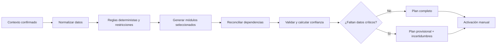

# Flujos de usuario V1

Estado: aprobado para diseño y prototipo; no es implementación.

Este documento describe el recorrido observable de una persona invitada y de
la cuenta superadministradora. La aplicación debe poder continuar con un plan
provisional cuando falte información, mostrando qué falta y qué módulos tienen
menor precisión.

## 1. Alta por invitación

**Entrada:** ruta pública de la aplicación y secreto de invitación válido
introducido en el formulario; persona adulta (18 años o más). El secreto nunca
forma parte del enlace, path, query o fragmento.

1. La persona abre la aplicación publicada.
2. Introduce la invitación.
3. Confirma que tiene 18 años o más y acepta el uso interno de la herramienta.
4. El sistema crea el perfil remoto y solicita un alias visible.
5. Se genera un código privado de vinculación de alta entropía; se
   muestra una sola vez con instrucciones para guardarlo.
6. Se crea la primera sesión de dispositivo.
7. Se ofrecen los módulos del plan, sin obligar a activar entrenamiento.

**Reglas:** no hay alta pública en V1; no se crean perfiles para menores; el
alias nunca es un secreto; el código privado sí lo es.

## 2. Acceso desde otro dispositivo

**Entrada:** perfil existente y segundo dispositivo.

1. En el dispositivo nuevo se elige «Ya tengo un perfil».
2. Se introduce el alias y el código privado, o se escanea un QR de vinculación generado en
   un dispositivo ya autenticado.
3. El QR contiene un payload opaco no URL, de un solo uso, de vida corta y sin
   datos de salud. El escáner lo envía únicamente en el cuerpo de un `POST`.
4. El sistema valida el token, concede la membresía a la identidad independiente
   del dispositivo y sincroniza el último borrador/plan activo.
5. Si el dispositivo pertenece a varios perfiles, se muestra un selector con
   solo sus aliases autorizados.
6. El usuario puede consultar los dispositivos vinculados al perfil y revocar
   esa membresía sin afectar otros perfiles del mismo dispositivo.

**Alternativas:** si el QR caduca, se genera otro; si el código se renueva,
las membresías existentes permanecen salvo que el usuario revoque las demás.

Si el usuario pierde el código pero conserva una sesión, puede rotarlo. Si no
conserva ninguna sesión, el QR no sirve como recuperación: solo el
superadministrador puede ejecutar un restablecimiento excepcional.

**Invariante:** un alias por sí solo no concede acceso.

## 3. Cuestionario adaptativo (objetivo: 15–20 minutos)

El asistente muestra progreso, tiempo estimado para completar, guardado automático y una
sección cada vez. Usa selectores, chips, búsqueda con sugerencias y texto
mínimo.

1. **Núcleo:** edad, sexo, altura, peso, país (España en V1), contexto de
   actividad, objetivo principal y hasta dos secundarios (composición,
   rendimiento, bienestar), horarios y preferencias generales.
2. **Módulos:** el usuario activa alimentación, entrenamiento, hidratación,
   sueño/descanso, movilidad/estiramiento y suplementación.
3. **Alimentación:** comidas (2–6), alergias y contaminación cruzada,
   intolerancias (cantidad tolerada y gravedad), preferencias/rechazos,
   ansiedad alimentaria, proteína en polvo (sí/no) y supermercado opcional.
4. **Entrenamiento:** generado, entrenamiento propio o ausencia de
   entrenamiento; estilo preferido, disponibilidad, equipamiento y límites.
5. **Hidratación:** media diaria, bebidas habituales, clima/actividad/sudor,
   anclajes y recordatorios opcionales (desactivados inicialmente).
6. **Sueño:** horas, horario, regularidad, calidad percibida, turnos y datos
   REM/profundo/ligero copiados manualmente del dispositivo como estimaciones;
   no hay sincronización/importación en V1.
7. **Movilidad:** zonas, molestias declaradas y disponibilidad; núcleo de 5
   minutos con extensiones opcionales.
8. **Suplementación:** productos actuales, dosis/frecuencia/horario cuando se
   conozcan, preferencia por recomendaciones y objetivos.
9. **Contexto clínico y farmacológico:** enfermedades, embarazo/lactancia,
   menopausia, medicación y tratamientos hormonales; buscador con sugerencias
   y opción de añadir texto breve.
10. **Laboratorio manual opcional:** de uno a cuatro valores normalmente,
    unidad, fecha/rango aproximado y fuente. No se importa OCR/PDF en V1.

Los campos condicionales aparecen solo cuando pueden cambiar una decisión. Una
pregunta crítica sin respuesta abre una incertidumbre y permite continuar con
un plan provisional conservador.

Se requiere al menos un módulo. El núcleo y las ramas comunes no contienen
campos de texto largo obligatorios; las entradas ausentes de los catálogos usan
texto breve limitado.

## 4. Resumen y confirmación del contexto

1. Se presenta un resumen editable por bloques.
2. Cada dato indica si es conocido, estimado o ausente.
3. Se muestra qué módulos se generarán y qué preguntas han quedado sin
   responder.
4. El usuario corrige datos con selectores/búsqueda y confirma «Generar».
5. El borrador queda guardado incluso si el usuario abandona el flujo.

## 5. Generación completa o provisional

- El motor determinista es la fuente de verdad.
- Las reglas se clasifican como obligatorias, condicionales o preferentes.
- Se optimiza únicamente dentro del espacio seguro resultante.
- Un plan provisional no oculta límites ni inventa datos.
- La activación es manual y separa estado `completo/provisional` de
  `borrador/activo/archivado`.

## 6. Activación manual del plan

1. Se muestra el candidato con cambios, módulos afectados, objetivos,
   incertidumbres y validaciones.
2. El usuario puede activarlo o volver a editar el contexto.
3. Solo un plan queda activo por perfil; el anterior pasa a archivado.
4. El plan activo conserva contexto, fecha, versión de reglas, fuentes y
   configuración del modelo.

## 7. Consulta y edición controlada

1. La pantalla principal muestra estado del plan, fecha, confianza y alertas
   proporcionales.
2. Se navega por día, semana y módulo.
3. En alimentación se puede alternar ingredientes/cantidades y preparación
   breve; cada alimento tiene dos sustituciones funcionales.
4. El usuario cambia alimentos, horarios, días o ejercicios mediante opciones,
   nunca editando libremente los números críticos.
5. El sistema detecta impacto, recalcula solo módulos afectados y dependencias,
   valida de nuevo y crea un candidato.
6. La activación del candidato sigue siendo manual; el plan activo nunca se
   modifica en silencio.

## 8. Seguimiento

### Revisión semanal mínima

1. Se preguntan únicamente variables aplicables al plan activo.
2. Se registran adherencia, cambios relevantes, síntomas importantes,
   hidratación, sueño y entrenamiento solo si el módulo está activo.
3. Los diarios detallados son opcionales; omitirlos reduce precisión, no
   bloquea la continuidad.
4. El sistema muestra tendencia básica, sin predicciones clínicas.

### Revisión completa de cuatro semanas

1. Se revisa el contexto completo y los objetivos.
2. Se comparan cambios con el plan base estable y repetible.
3. Se propone un candidato si el impacto es material.
4. El usuario activa manualmente o conserva el plan.

Un cambio farmacológico, clínico, de embarazo/lactancia, de entrenamiento o de
objetivo puede abrir una revisión antes de cuatro semanas.

## 9. Compra y comparación de supermercados

1. Desde el plan activo se genera la lista semanal agregada.
2. El usuario elige supermercado habitual o activa comparación entre cadenas.
3. Se muestran producto, formato, paquetes necesarios, sobrante estimado,
   precio base y coste orientativo; no se incluyen ofertas, cupones, transporte
   ni checkout.
4. La elección habitual se mantiene aunque otra cadena sea más barata; se
   puede mostrar una recomendación de ahorro sin cambiarla.
5. La compra optimiza el desembolso real: formatos, paquetes, sobrantes y
   cobertura. Si falta equivalencia, aparece «Sin producto confirmado».
6. El catálogo comercial no altera los valores nutricionales del plan.
7. Se puede ordenar por precio ascendente (por defecto), precio descendente,
   A–Z o Z–A; el orden es idéntico en pantalla, PDF e impresión.

## 10. Exportación e impresión

1. El usuario elige PDF compacto (elecciones actuales) o completo (todas las
   alternativas).
2. Elige «solo ingredientes y cantidades» o «preparación breve».
3. Puede exportar semana, lista de compra y preparación semanal.
4. También puede descargar una hoja editable compatible con Excel/Google
   Sheets en formato XLSX, con hojas de plan, compra, preparación y metadatos
   según el contenido exportado.
5. Los PDFs omiten nombres de compuestos farmacológicos/anabólicos; muestran
   únicamente las adaptaciones aplicadas y las advertencias necesarias.

## 11. Sesiones, borrado y superadministración

### Usuario

- Consulta dispositivos vinculados al perfil, fecha y actividad.
- Revoca otras membresías del perfil o renueva el código privado.
- Solicita eliminación permanente. El superadministrador la ejecuta con
  confirmación reforzada; el perfil queda bloqueado y el alias reservado
  mientras se purga. Solo cuando el `DeletionJob` alcanza `purged` y elimina la
  fila del perfil el alias queda reutilizable; el ledger externo conserva un
  marcador irreversible mínimo para impedir restauración.

### Superadministrador

- Accede a usuarios, cuestionarios, planes, métricas y catálogos.
- Puede restablecer acceso, revocar sesiones e impersonar perfiles.
- La interfaz mantiene un indicador persistente «Sesión de superadministrador».
- Los cambios de superadministrador no se muestran al usuario común, pero dejan
  registro técnico privado.
- Las copias cifradas semanales, previas a cambios críticos y cuatro rotativas
  no pueden reactivar un perfil eliminado.
