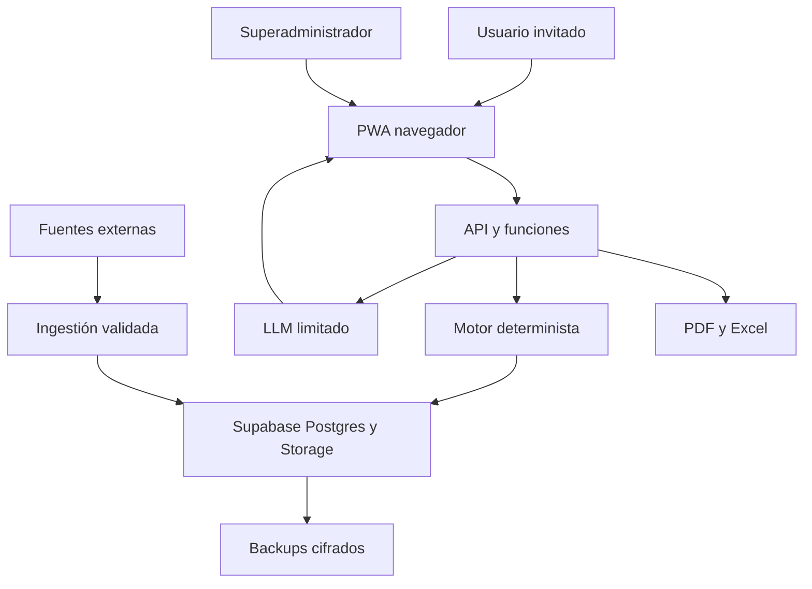

# Modelo de amenazas de V1

**Estado:** planificado; no es una declaración de controles ya implementados.  
**Fecha:** 2026-07-16  
**Alcance:** producto web privado de planificación de salud, nutrición y entrenamiento para adultos en España.

## Executive summary

Los riesgos principales son la exposición o modificación indebida de datos de salud, la suplantación mediante alias/códigos/QR, el abuso de privilegios del superadministrador, y la activación de planes clínicamente inseguros por una regla o revisión defectuosa. La V1 todavía no implementa la aplicación: los controles descritos como “planificados” deben convertirse en pruebas de aceptación antes de invitar a usuarios. El catálogo actual contiene scripts y datos de supermercado, pero no constituye autenticación, autorización ni protección de datos.

## Scope and assumptions

### En alcance

- PWA desplegada en Internet, por invitación, inicialmente para un máximo de diez usuarios adultos (18+).
- Perfil remoto multidispositivo con alias visible, código privado de alta entropía y QR de un solo uso con caducidad.
- Cuestionario, planes, historial, datos clínicos/farmacológicos, laboratorios manuales, catálogos nutricionales, listas de compra, exportaciones y seguimiento.
- Superadministrador con acceso total, restablecimiento, revocación e impersonación; indicador persistente de modo administrador y log técnico privado.
- Entornos de desarrollo y producción independientes; copias cifradas semanales, previas a cambios críticos y cuatro rotaciones.
- Reglas deterministas, revisión manual de candidatos, generación textual limitada por un LLM posterior a la validación.

### Fuera de alcance de V1

- Menores, integración con Apple Health/Health Connect/Garmin/Fitbit, OCR de informes, extracción automática de PDF o verificador farmacológico exhaustivo.
- Checkout, pedidos, transporte, cupones, fidelización o scraping diario de precios.
- Recomendación o modificación de anabolizantes, SARMs, péptidos, “test boosters” o fármacos.
- Cumplimiento legal completo de RGPD/regulación sanitaria como criterio de lanzamiento; sí se mantienen controles técnicos de minimización, autorización y borrado.

### Estado de evidencia

| Evidencia | Estado | Uso en este documento |
|---|---|---|
| `supermercados/catalogo.py` | existente, no revisado para producción | entrada de datos de catálogo; no es control de seguridad |
| `supermercados/mercadona_chrome.mjs` | existente, automatización local | superficie de scraping; no debe recibir secretos de producción |
| `datos/*` | existente, datos locales | datos potencialmente públicos; no mezclar con perfiles de salud |
| Aplicación web, API, RLS, sesiones | planificado | controles requeridos, todavía no implementados |
| Este paquete documental | planificado | contrato para implementación y verificación |

### Supuestos abiertos que cambian el riesgo

- La base de datos y Storage se alojarán en un proyecto Supabase de región UE, con RLS activado y claves de servicio solo en servidor.
- Cloudflare Pages servirá el frontend; las operaciones privilegiadas pasarán por funciones/API del servidor, no por el navegador.
- El superadministrador será una identidad separada de cualquier perfil de usuario y sus acciones se asociarán a una sesión administrativa.
- El código privado no se almacenará en claro; se conservará una derivación no reversible y se podrán revocar sesiones.
- El usuario invitado no puede modificar reglas clínicas, fuentes, catálogos canónicos ni estados de publicación.

## System model

### Primary components

1. **Navegador/PWA:** cuestionario, resumen editable, consulta de plan, seguimiento y exportación. Recibe entradas no confiables.
2. **Capa de aplicación/API:** valida esquemas, normaliza entradas, comprueba autorización y orquesta motor determinista, persistencia y exportación.
3. **Motor determinista:** cálculos, restricciones obligatorias/condicionales/preferentes, impacto de cambios y validaciones; es la única fuente de verdad.
4. **Capa LLM limitada:** Luna con razonamiento mínimo, solo para explicación, resumen y lenguaje sencillo después de pasar validaciones.
5. **Supabase/Postgres/Storage:** identidad, perfiles, planes versionados, datos clínicos, catálogo, documentos y backups configurados por operación.
6. **Funciones de administración:** invitaciones, rotación/revocación de códigos, impersonación, activación manual, publicaciones y borrado permanente.
7. **Fuentes externas:** AEMPS/CIMA, bases nutricionales y feeds de supermercados. Se tratan como datos importados no confiables hasta validación y publicación.

### Data flows and trust boundaries

- **Internet → PWA:** alias, código, QR y formularios; HTTPS, CSP,
  validación de tamaño/tipo y sin secretos en URL. V1 no acepta informes ni
  archivos clínicos.
- **PWA → API:** payloads JSON versionados; autenticación de sesión, autorización por perfil/rol, límites de tamaño y esquema estricto antes de persistir.
- **API → motor determinista:** contexto normalizado; solo tipos internos validados. El motor no debe leer directamente del navegador ni del LLM.
- **Motor → persistencia:** plan candidato/activo con versión, hash de reglas, fuentes, fecha, incertidumbres y estado complete/provisional; transacción y control de concurrencia.
- **API → Luna:** únicamente datos mínimos necesarios para lenguaje; salida JSON con esquema; números, restricciones, alimentos, ejercicios, dosis, advertencias y estados se ignoran si intentan modificarse.
- **Fuentes externas → ingestión:** respuestas HTTP/CSV/JSON y etiquetas de productos; sandbox de parser, límites, validación de procedencia, revisión de discrepancias y publicación manual.
- **Usuario/superadmin → exportación:** PDF/Excel generado desde la versión
  activa; exclusión de compuestos sensibles, control de autorización y
  descarga proxy autenticada sin bearer de Storage en URL.
- **API → backups/ledger R2:** copia cifrada, pre-cambio crítico y cuatro
  versiones rotativas; el borrado registra fuera de Supabase antes de purgar y
  todo restore verifica el ledger.

#### Diagram

## Assets and security objectives

| Asset | Why it matters | Security objective (C/I/A) |
|---|---|---|
| Datos de salud y contexto clínico | Pueden causar daño, estigma o discriminación si se exponen o alteran | C alta / I alta / A media |
| Planes activos e historial | Cambios incorrectos pueden inducir conducta insegura | C alta / I crítica / A media |
| Código privado, QR y sesiones | Permiten vincular o abrir perfiles en otro dispositivo | C crítica / I alta / A media |
| Identidades y roles | El superadministrador controla todos los datos y reglas | C alta / I crítica / A alta |
| Reglas, fuentes y catálogo canónico | Determinan cálculos, restricciones y selección de alimentos | C media / I crítica / A media |
| Claves, tokens y secretos | Su compromiso permite leer o modificar datos según su alcance | C crítica / I crítica / A alta |
| Logs técnicos privados | Permiten investigar abuso administrativo y restauraciones | C crítica / I alta / A media |
| Backups y marcas de borrado | Restaurar datos eliminados puede reidentificar perfiles | C crítica / I crítica / A media |
| Presupuesto/cómputo LLM | El abuso puede agotar el límite de 10 €/mes o bloquear planes | C baja / I media / A alta |
| Artefactos de build y despliegue | Una cadena comprometida cambia frontend y controles | C media / I crítica / A alta |

## Attacker model

### Capabilities

- Atacante remoto sin invitación que prueba alias, rutas, códigos, QR y endpoints públicos.
- Usuario invitado que intenta leer o editar otro perfil, reutilizar un QR, aumentar privilegios o cargar datos malformados.
- Usuario con su propio dispositivo comprometido que intenta reutilizar sesiones, copiar exportaciones o abusar de la API.
- Fuente/feed externo malicioso o defectuoso que intenta introducir datos, enlaces, etiquetas o precios no válidos.
- Dependencia o artefacto de build comprometido con capacidad de alterar el cliente o el pipeline.
- Superadministrador legítimo o cuenta administrativa comprometida; se modela como impacto de máximo privilegio, aunque no se impida su acceso total.

### Non-capabilities

- No se asume acceso físico al servidor, a las claves maestras ni al proveedor cloud salvo compromiso independiente.
- No se atribuye al usuario capacidad de modificar reglas publicadas, migraciones o el repositorio.
- No se considera que una discrepancia de precio regional sea un incidente de seguridad; sí una posible falta de integridad de producto.
- No se modela diagnóstico médico automatizado: el producto solo adapta y presenta planes bajo reglas documentadas.

## Entry points and attack surfaces

| Surface | How reached | Trust boundary | Notes | Evidence (repo path / symbol) |
|---|---|---|---|---|
| Invitación y acceso | enlace/código/QR desde Internet | Internet → API | enumeración, replay, expiración | implementado en T3–T4; invitaciones reales pendientes |
| Cuestionario | PWA | PWA → API | campos clínicos, texto libre, dosis, unidades | planificado; `supermercados/catalogo.py` solo demuestra patrón local de parsing |
| Carga de código de barras/etiqueta | PWA/API | PWA → ingestión | payload falsificado, campos incompletos, cross-contact | planificado |
| Fuentes nutricionales y farmacológicas | ingestión programada/manual | externo → ingestión | parser, procedencia y discrepancias | `datos/README.md`, `supermercados/catalogo.py` |
| Generación y edición de plan | API | API → motor | manipulación de restricciones o versiones | planificado |
| Exportación PDF/Excel | PWA/API | API → archivo | filtrado de compuestos, XSS/fórmulas, cache | planificado |
| Funciones superadmin | panel/endpoint autenticado | usuario → privilegio | impersonación, borrado, publicación | AAL2, Edge y ledger remoto implementados; cuenta real pendiente |
| Backups/restauración | operador/proveedor | operación → datos | reaparición de perfiles borrados | planificado |
| Dependencias y despliegue | CI/Cloudflare | build → producción | artefactos alterados | `.gitignore` y scripts actuales no son pipeline de producción |

## Top abuse paths

1. **Acceso por enumeración:** atacante prueba alias → recibe diferencia observable → reintenta códigos débiles → abre perfil y exporta datos.
2. **Replay de QR:** usuario captura un QR → lo reutiliza después de su uso → obtiene una segunda sesión persistente.
3. **IDOR de perfil:** usuario autenticado modifica un `profile_id` → API confía en el identificador → cambia el plan de otra persona.
4. **Escalada administrativa:** sesión administrativa robada → endpoint de impersonación sin indicador/registro → lee o altera todos los perfiles.
5. **Restauración indebida:** operador restaura backup anterior → reaparecen datos borrados → el sistema los vuelve a servir como activos.
6. **Catálogo envenenado:** feed externo incluye una variante o etiqueta maliciosa → ingesta la acepta como canónica → plan o lista de compra usa un dato incorrecto.
7. **LLM fuera de límites:** entrada adversarial se envía a Luna → salida contiene números o advertencias inventados → UI no valida el JSON → usuario recibe una instrucción errónea.
8. **Exportación peligrosa:** nombre de alimento contiene fórmula/HTML → exportador lo copia a Excel/PDF → abre código o revela datos en una URL cacheada.
9. **Agotamiento de recursos:** atacante repite generación/exportación → se consumen CPU, almacenamiento o presupuesto LLM → usuarios legítimos quedan sin servicio.

## Threat model table

| Threat ID | Threat source | Prerequisites | Threat action | Impact | Impacted assets | Existing controls (evidence) | Gaps | Recommended mitigations | Detection ideas | Likelihood | Impact severity | Priority |
|---|---|---|---|---|---|---|---|---|---|---|---|---|
| TM-001 | remoto | endpoint de acceso observable | enumera alias/códigos | exposición de perfiles | sesiones, salud | respuesta uniforme, rate limit por candidato/IP y código de 128 bits implementados | alertas operativas pendientes | conservar pruebas de no enumeración y alertar por ratio fallo/éxito | intentos por alias/IP y ratio fallo/éxito | media | crítica | high |
| TM-002 | invitado | QR capturado | reutiliza QR consumido | sesión no autorizada | sesiones, planes | QR opaco, un uso, TTL de cinco minutos y consumo transaccional implementados | prueba remota positiva pendiente de invitación real | conservar invalidación inmediata y prueba concurrente | replay y consumo duplicado | baja | alta | medium |
| TM-003 | invitado | sesión propia | cambia IDs de perfil | lectura/escritura cruzada | salud, planes | RLS por actor, membresía, sesión y perfil activo; pruebas IDOR locales | prueba remota positiva pendiente | mantener RLS como barrera primaria y pruebas por recurso | auditoría de denegaciones | baja | crítica | high |
| TM-004 | remoto | token robado mediante dispositivo o XSS | reutiliza sesión | acceso persistente | sesiones, todo el perfil | JWT 15 min, rotación/reuse 10 s, sesiones 30/180, revocación RLS y cleanup huérfano implementados | alertas de sesión anómala pendientes | conservar CSP exacta, revocación y alertas | replay, sesiones vencidas y simultáneas anómalas | media | crítica | high |
| TM-005 | atacante administrativo | cuenta superadmin comprometida | impersona y cambia datos | compromiso total | todos los perfiles y reglas | AAL2, desafío TOTP no anterior a cinco minutos, indicador persistente, actor original/efectivo y ledger cifrado remoto con HMAC | falta provisionar y probar la primera cuenta real; alertas operativas pendientes | MFA obligatorio, reautenticación, actor original/efectivo y alertas | log de impersonación, intents pendientes y cambios masivos | media | crítica | critical |
| TM-006 | invitado | input de cuestionario | inyecta HTML/SQL/fórmulas o agota parser | XSS, corrupción, ejecución/caída | perfiles, exportaciones | planificado: esquema y normalización | no implementado | escape contextual, allowlist, límites 256 KiB/profundidad 12, exportación segura y consultas parametrizadas | payloads sobrelímite rechazados y CSP reports | media | alta | high |
| TM-007 | fuente externa | feed no confiable | introduce valores o identidad falsa | plan inseguro | catálogo, reglas, planes | planificado: procedencia y revisión manual | ingestión actual local no tiene publicación | cuarentena, firma/hash de fuente, reconciliación, activación manual | discrepancias por umbral y cambios masivos | media | crítica | high |
| TM-008 | usuario/adversario | regla no validada | fuerza relajación de restricción | recomendación insegura | motor, plan activo | contrato: restricciones obligatorias y motor determinista | sin motor implementado | separar permisos de reglas, validación de invariantes, no ejecutar reglas del cliente | candidate diff y fallo de invariantes | baja | crítica | high |
| TM-009 | prompt adversarial | llamada a LLM | induce números o dosis inventados | información peligrosa | explicaciones, confianza | contrato: LLM posterior y no dueño de cálculos | guardia de salida pendiente | JSON schema, variables allowlisted, rechazo íntegro y fallback determinista | rechazo de campos/claims prohibidos | media | alta | high |
| TM-010 | atacante de disponibilidad | endpoint de generación/exportación | repite solicitudes pesadas | coste y caída | API, presupuesto, disponibilidad | límite de 10 €/mes acordado | rate limit y presupuesto no implementados | ventanas por perfil/actor/IP, idempotencia, reutilización de artefacto, cota máxima EUR/FX atómica, timeout pendiente, kill switch y alertas de anomalía | p95, 429, reservas, errores y coste por operación | media | alta | high |
| TM-011 | invitado | datos de error/log | provoca excepción | filtra contexto clínico | logs, secretos | planificado: log técnico privado | redacción pendiente | allowlist antes de proxy/Edge/error/job; no body/query/headers; canarios de token/QR/medicación | escaneo de todos los sinks y patrones de excepción | media | alta | high |
| TM-012 | operador/bug | restore sin exclusiones/continuidad | reanima perfil, trunca auditoría o acepta hueco falso | violación de borrado/trazabilidad | backups, salud, auditoría | contrato: streams R2 independientes + copia local cifrada | restauración no implementada | tombstone antes de purga, intent/outcome con reconciliación, AEAD/Ed25519, manifiesto de rangos borrados y prueba de cuatro copias | divergencia, hueco no cubierto, intent pendiente y comparación borrado/auditoría/restore | baja | crítica | high |
| TM-013 | supply chain | dependencia/build comprometido | altera cliente o pipeline | bypass de controles | artefactos, secretos | contrato: lockfile, SCA, SBOM y procedencia/firma | CI y release no implementados | revisión, escaneo, artefactos firmados, secretos fuera del build y bloqueo por severidad | hashes, provenance y alertas de dependencia | baja | crítica | high |
| TM-014 | usuario | nombre/SKU malicioso | inserta fórmula en Excel | ejecución al abrir | exportación | planificado: sanitización de hojas | no implementado | neutralizar prefijos de fórmula, límites de longitud, descarga no cacheada | pruebas con payloads de fórmula | media | media | medium |
| TM-015 | fuente externa | URL redirigida | provoca SSRF durante ingestión | acceso a red interna | ingestión, secretos | no se ha implementado ingestión remota | no implementar fetch arbitrario | allowlist de dominios, egress restringido, sin seguir redirecciones internas | logs de DNS/HTTP y bloqueos | baja | alta | medium |
| TM-016 | usuario | archivo inesperado | intenta alcanzar parser/storage no previsto | caída o coste | API, Storage | V1 no acepta informes/OCR/PDF de entrada | endpoint no debe existir | rechazar uploads clínicos, límites de bytes en activos permitidos | intentos de multipart y tamaño | baja | media | medium |
| TM-017 | superadmin/bug | publicar candidato | activa regla sin revisión | riesgo sistemático | reglas, planes | activación manual requerida | guardas de rol pendientes | AAL2, diff, confirmación y bloqueo si falla validación normativa | historial de publicación y rollback | baja | crítica | high |
| TM-018 | usuario | preferencia comercial | confunde SKU con alimento canónico | calorías/macros incorrectos | catálogo, listas, planes | canon nutricional independiente del SKU | matching no implementado | no cambiar verdad nutricional por precio/SKU; estado “sin producto confirmado” | métricas de equivalencia y overrides | media | alta | high |

## Criticality calibration

- **critical:** un camino plausible permite leer/modificar múltiples perfiles,
  autoasignar superadministrador o activar sistemáticamente planes contra una
  restricción obligatoria. Ejemplos: IDOR general, cuenta admin sin MFA.
- **high:** compromete un perfil completo, una regla crítica, una restauración o
  una exportación sensible, pero exige sesión, condición adicional o alcance
  limitado. Ejemplos: replay de QR, catálogo envenenado revisable.
- **medium:** produce coste, disponibilidad parcial o ejecución en un artefacto
  sin acceso directo general a salud. Ejemplos: fórmula XLSX, SSRF limitado.
- **low:** impacto menor y reversible sin tocar salud, identidad ni plan
  normativo. En el modelo actual no se conserva ninguna amenaza como low.

## Mitigaciones priorizadas por fase

1. **Antes de primer usuario:** TM-001–005, TM-008, TM-012 y TM-017; sin estas comprobaciones no se debe abrir una invitación.
2. **Antes de importar fuentes:** TM-006–007, TM-015–016 y TM-018; el catálogo actual es una entrada local, no una frontera confiable.
3. **Antes de activar Luna:** TM-009–011; probar salida estructurada y fallback con presupuesto agotado.
4. **Antes de exportar:** TM-006 y TM-014; usar datos sintéticos en pruebas y verificar no-cache.
5. **Antes de producción sostenida:** TM-010 y TM-013; configurar cuotas, observabilidad, lockfile, SBOM y restauración ensayada.

## Focus paths for manual security review

Estos paths son futuros y deben existir durante la implementación; los scripts actuales no sustituyen esta revisión:

- superficie de acceso — intercambio de código, QR, sesión y revocación;
- `src/server/authorization/` — autorización por perfil, rol e impersonación.
- `src/server/plans/` — versionado, activación y control de concurrencia.
- `src/server/engine/` — restricciones, invariantes y límites de seguridad.
- `src/server/ingestion/` — parsers, procedencia y cuarentena.
- `src/server/exports/` — PDF/Excel, escape y exclusión de compuestos.
- `supabase/migrations/` — RLS, índices, constraints y triggers.
- `supabase/functions/` — secretos, endpoints privilegiados y rate limits.
- `.github/workflows/` — supply chain y publicación.
- `supermercados/` — scraper local; mantenerlo separado de credenciales y datos de salud.

## Quality check

- [x] Se han enumerado entradas web, administrativas, fuentes, exportaciones, backups y build.
- [x] Cada frontera de confianza aparece en al menos un abuso o amenaza.
- [x] Se separan runtime, fuentes externas y tooling local.
- [x] Se distinguen controles planificados de controles ya evidenciados en el repositorio.
- [x] Se explicitan supuestos, preguntas abiertas y caminos futuros.
- [ ] Falta validar en implementación: RLS real, rotación de claves, headers, límites y restauración.
